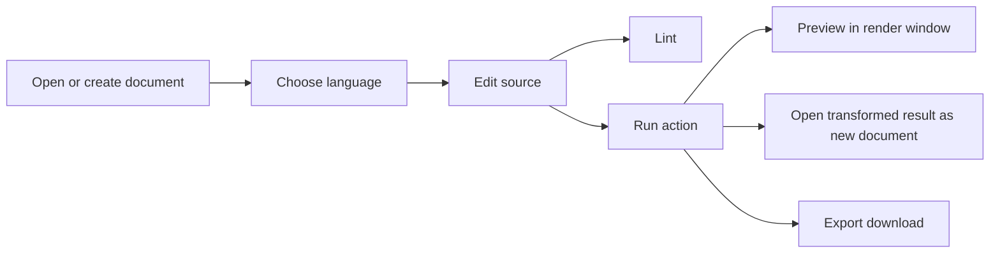
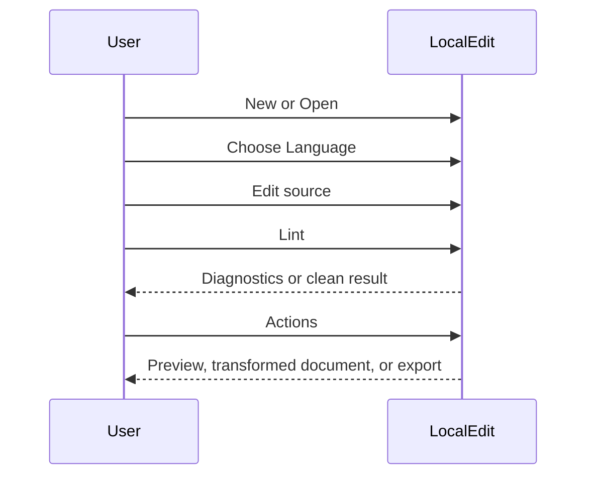
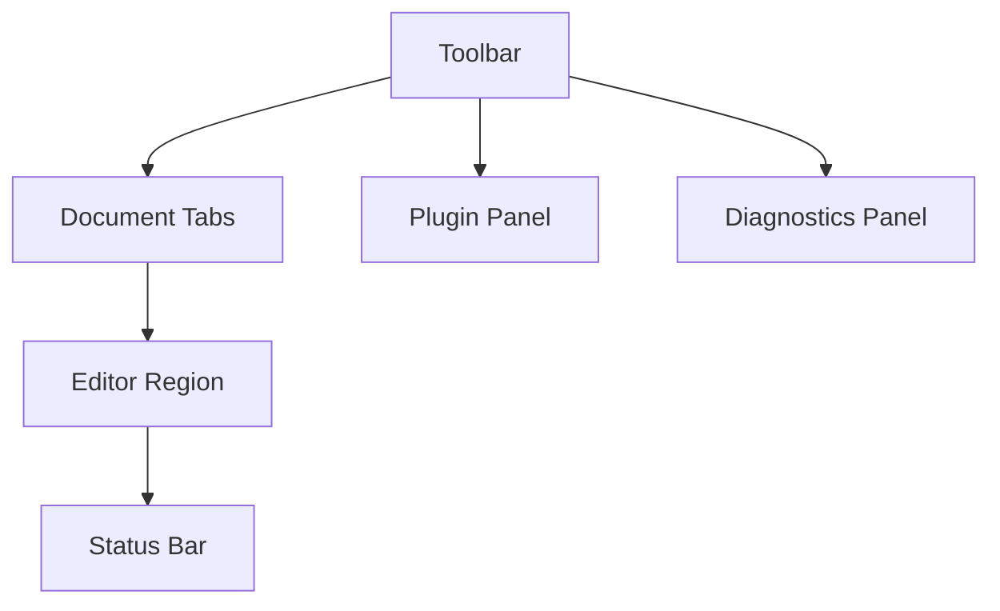
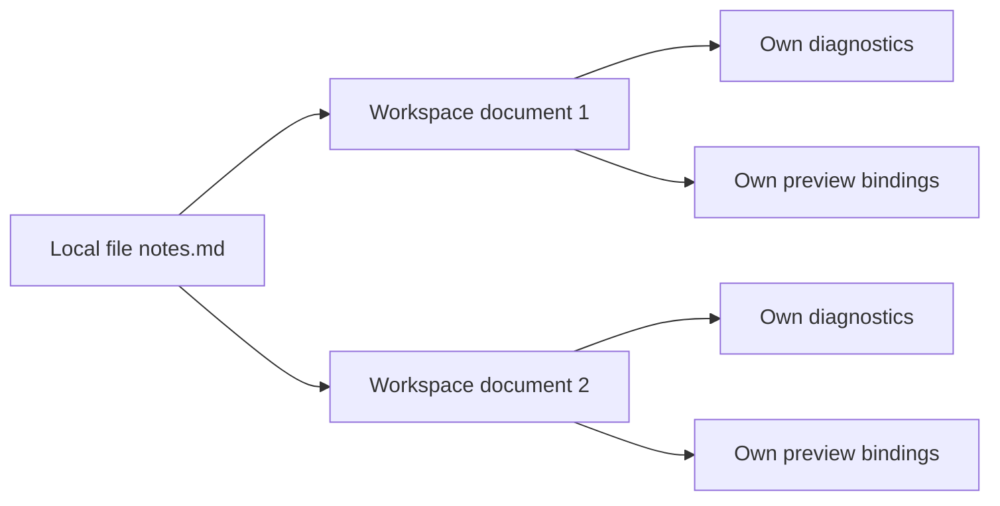
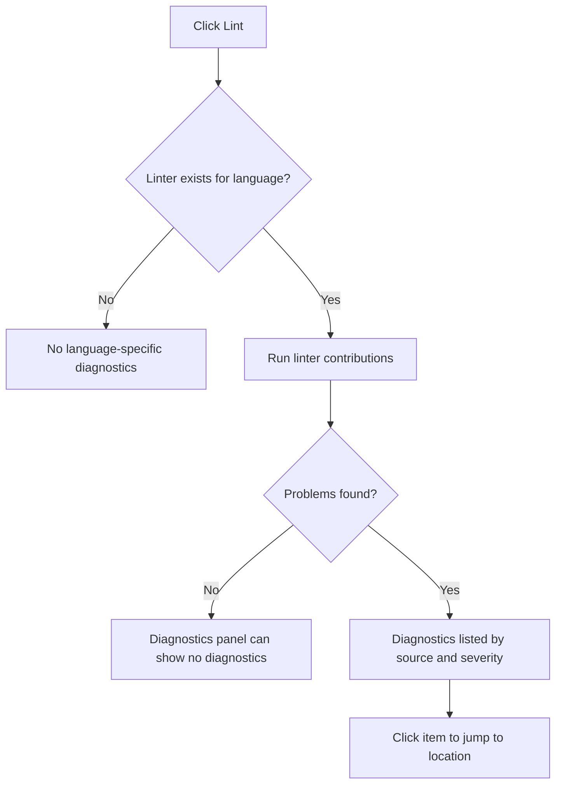
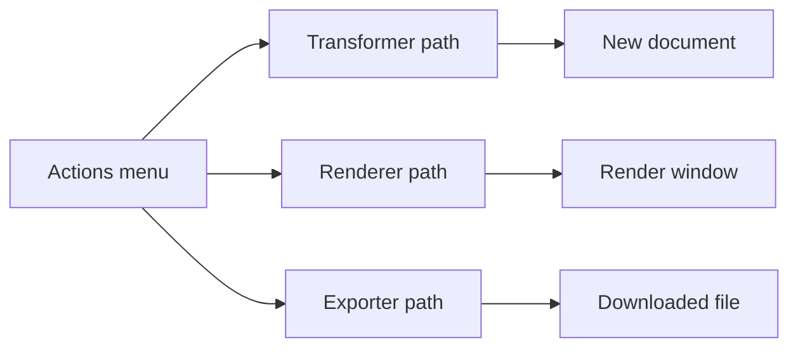
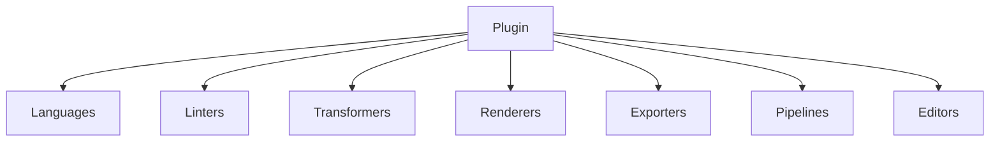
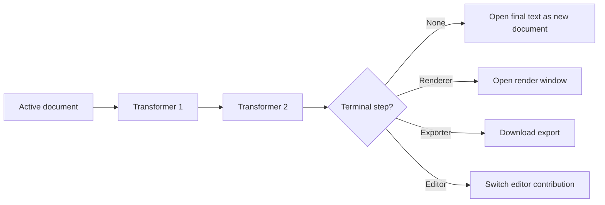
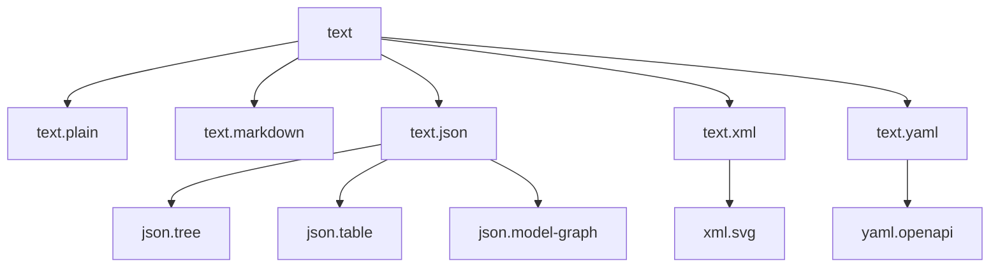

# LocalEdit User Manual

This manual explains LocalEdit in layers. The early chapters focus on the shortest path to being productive. Later chapters revisit the same features with more detail so you can understand how the workbench behaves, why actions appear, and how to use advanced capabilities without guesswork.

## Table of Contents

- [1. What LocalEdit Is](#1-what-localedit-is)
- [2. Start in Five Minutes](#2-start-in-five-minutes)
- [3. Understand the Screen](#3-understand-the-screen)
- [4. Work With Documents](#4-work-with-documents)
- [5. Choose Language and Editor](#5-choose-language-and-editor)
- [6. Check Documents With Lint](#6-check-documents-with-lint)
- [7. Run Actions, Previews, and Exports](#7-run-actions-previews-and-exports)
- [8. Manage Plugins](#8-manage-plugins)
- [9. Understand Pipelines](#9-understand-pipelines)
- [10. Language Hierarchy and Format Families](#10-language-hierarchy-and-format-families)
- [11. Persistence, Modes, and Safety Model](#11-persistence-modes-and-safety-model)
- [12. Advanced Usage Patterns](#12-advanced-usage-patterns)
- [13. Troubleshooting](#13-troubleshooting)
- [14. Command Reference](#14-command-reference)

## 1. What LocalEdit Is

LocalEdit is a local-first editor workbench for structured text, source text, and derived views such as diagrams, tables, trees, reports, and exported files.

At the simplest level, you can think of it as this:

- You open or create text documents.
- You tell LocalEdit what language the document uses.
- LocalEdit shows the tools that apply to that language.
- Those tools can lint, transform, preview, or export your document.

That basic model scales to everything else in the application.

### What LocalEdit is good at

- Editing text formats such as Markdown, JSON, YAML, XML, CSV, JavaScript, Python, Mermaid, Graphviz, SVG, Gephi GEXF, and Indented Tree.
- Converting one representation into another through reusable pipelines.
- Opening derived results as new documents so you can keep working instead of losing intermediate output.
- Rendering local previews and interactive graph explorers without depending on a backend service.
- Managing multiple open documents in one workspace.

### What LocalEdit is not

- It is not a cloud editor.
- It is not a runtime package manager.
- It is not a fully sandboxed plugin host.
- It does not depend on remote APIs or CDNs at runtime.

If you want the shortest path to usefulness, continue with [2. Start in Five Minutes](#2-start-in-five-minutes). If you want the conceptual model first, continue with [3. Understand the Screen](#3-understand-the-screen).

## 2. Start in Five Minutes

This chapter keeps the model intentionally simple.

### Local file mode

1. Open [editor-workbench/index.html](editor-workbench/index.html) in a browser.
2. Click **New** to create a blank document, or click **Open** to load a local file.
3. If needed, use the **Language** menu to choose the document language.
4. Edit the text.
5. Click **Lint** to check the document.
6. Open **Actions** and choose a preview, transform, or export action.
7. Click **Save** if you want to download the current source text.

### Extension mode

1. Open Chrome or Edge extension management.
2. Enable developer mode.
3. Load [editor-workbench/manifest.json](editor-workbench/manifest.json) as an unpacked extension.
4. Open the extension and use the same toolbar workflow.

### First things to know

- **Open** also accepts drag and drop. You can drop a local file onto the Open button.
- **Save** downloads the current source document. Export actions may download different output files.
- The **Actions** menu changes with the active document language.
- If a command is disabled, LocalEdit usually needs an open document, a selected language, or an available renderer or pipeline.

### The quickest successful first run

If you want a predictable first experience:

1. Create a new document.
2. Set the language to Markdown, JSON, Mermaid, or YAML.
3. Paste sample content.
4. Run **Lint**.
5. Use **Actions** to preview or transform it.

The rest of this manual explains each part in more depth.

## 3. Understand the Screen

Now that the core loop is clear, this chapter adds the UI structure behind it.

LocalEdit has five main areas:

- Toolbar
- Document tabs
- Editor region
- Side panels
- Status bar

### Toolbar

The toolbar is the command center. Its main controls are:

- **New**: create a blank document.
- **Open**: open a local file. Drag-and-drop onto this button also works.
- **Save**: download the current source document.
- **Language**: choose the active document language.
- **Editor**: switch the editing surface when multiple editors are available.
- **Reopen**: restore a tab closed earlier in the current session.
- **Lint**: run diagnostics for the active document.
- **Actions**: run language-aware pipeline actions.
- **Discover**: open a contribution catalog document.
- **Refresh**: refresh open render windows.
- **Auto 3s**: automatically refresh bound previews after three seconds of stable source text.
- **Steps**: when enabled, open intermediate transformer outputs as separate documents.
- **Plugins**: open the plugin manager panel.

### Document tabs

Each open document appears as a tab.

- Click a tab to switch documents.
- Double-click a tab title to rename its display name.
- Click the `x` on a tab to close it.
- If multiple open documents share the same file name, LocalEdit disambiguates them with numbered labels.

### Editor region

The center area shows the active document in the currently selected editor contribution. By default this is usually CodeMirror, but the exact editor options depend on registered contributions.

### Side panels

There are two built-in panels:

- **Plugin Manager**: manage packaged and known plugins.
- **Diagnostics**: inspect lint results and jump to problem locations.

### Status bar

The status bar provides short feedback such as startup status, pipeline completion, refresh status, and errors.

## 4. Work With Documents

This chapter adds the workspace model behind the tabs.

### The simple version

A document is the thing you are editing right now.

### The more accurate version

LocalEdit uses a multi-document workspace. Each open tab is a document instance with its own:

- text
- language
- display name
- diagnostics
- editor view state
- preview bindings
- persistence entry

That means two tabs can come from the same original file and still behave as separate workspace documents.

### Creating and opening

- **New** creates a fresh blank document.
- **Open** creates a new workspace document from a local file.
- Opening the same file again creates another document instance rather than reusing the first one.

### Closing and reopening

- Closing a tab hides it for the current session.
- Closed tabs move into the **Reopen** menu.
- The Reopen list shows recently closed documents first.
- Hidden closed tabs are not persisted across page reloads.

### Renaming tabs

Double-click the tab title to rename the displayed file label. This affects the workspace label and helps distinguish multiple related outputs.

### Derived documents from actions

Some actions produce text instead of a preview or a file download. When that happens, LocalEdit opens the result as a new document automatically.

This is important because the workbench treats transformed text as first-class output, not as disposable temporary data.

### What gets persisted

Workspace state persists open documents, active tab selection, and related metadata. LocalEdit also flushes current editor contents before workspace storage writes and during page unload.

If you want to understand why some state comes back after reload and some does not, jump to [11. Persistence, Modes, and Safety Model](#11-persistence-modes-and-safety-model).

## 5. Choose Language and Editor

This chapter starts with the basic rule and then adds the deeper model.

### The basic rule

Set the document language correctly. The available lints, transforms, previews, and exports depend on it.

### Why language matters so much

LocalEdit is contribution-driven. Tools are registered against languages, and the **Actions** menu is built from those registrations.

If the wrong language is selected:

- the expected linter may not run
- the expected preview may not appear
- transforms and exports may be missing

### Common language families

- Plain text
- Markdown
- Mermaid
- Graphviz DOT
- Indented Tree
- JSON and derived JSON dialects
- YAML and derived YAML dialects
- XML and derived XML dialects
- Gephi GEXF
- SVG
- CSV
- JavaScript
- Python
- Pipeline JSON

### The Language menu

The **Language** menu is hierarchical. LocalEdit groups languages according to their parent formats or explicit menu paths.

This means you do not need to memorize every exact language identifier to work effectively. You can usually find a format near its parent family.

### The Editor menu

The **Editor** menu switches the editing contribution for the active document.

In a typical setup you will see:

- CodeMirror for rich editing
- Textarea as a fallback editor

Switching editor changes the editing surface, not the underlying document.

### A useful habit

When you open a file and something seems missing, check these in order:

1. Is the right tab active?
2. Is the language correct?
3. Is the relevant plugin loaded?

The deeper language inheritance model is covered in [10. Language Hierarchy and Format Families](#10-language-hierarchy-and-format-families).

## 6. Check Documents With Lint

Linting is the fastest way to verify that LocalEdit understands your current document.

### What Lint does

When you click **Lint**, LocalEdit runs the linter contributions registered for the active document language.

Possible outcomes:

- no diagnostics
- warnings
- errors
- plugin-generated failures reported as diagnostics

### Diagnostics panel

The diagnostics panel shows each issue with:

- severity
- source
- message
- location

Selecting a diagnostic jumps to its location in the document.

### How to interpret lint results

- If diagnostics appear, fix the source text first.
- If no diagnostics appear but an expected tool is still missing, the issue is usually language selection or plugin availability rather than document validity.
- If linting reports a plugin failure, the plugin loaded but its linter threw an error while processing the document.

### Recommended use

Run lint before preview or export when working with structured formats such as JSON, YAML, XML, CSV, Mermaid, DOT, and Indented Tree.

## 7. Run Actions, Previews, and Exports

This chapter introduces the most important productivity concept in LocalEdit: almost everything beyond editing is exposed through **Actions**.

### The simple model

Open **Actions** and choose what you want to do with the current document.

### The more complete model

An action can lead to one of three outcomes:

- open a transformed text result as a new document
- open or refresh a render window
- download exported output

### Render windows

Render actions open a separate preview window. That window is bound to the active document instance.

Important behavior:

- the render window title reflects the bound document
- refresh can be triggered manually
- **Auto 3s** refreshes previews after three seconds of stable source text
- closing the source tab closes previews bound to that tab

### Refresh and Auto 3s

- **Refresh** updates existing render windows immediately.
- **Auto 3s** keeps them in sync after source edits settle for three seconds.

Use **Refresh** when you want manual control. Use **Auto 3s** when iterating rapidly on diagrams or formatted output.

### Steps

The **Steps** checkbox makes pipelines open intermediate transformer outputs as separate documents.

This is useful when:

- you are learning how a complex pipeline works
- you want to inspect a normalized intermediate format
- you need to debug why a later render or export step behaved unexpectedly

### Discover

The **Discover** button opens a contribution catalog document. Use it to browse available languages and the tools registered for them.

### Typical action examples

- Markdown to sanitized HTML preview
- Mermaid to SVG preview or export
- Graphviz DOT to SVG preview or export
- JSON or XML to tree-oriented views
- YAML to JSON conversion
- Indented Tree to graph, table, or report outputs

## 8. Manage Plugins

Plugins define most of the available languages and tools.

### The simple view

If a capability is missing, it is often because the relevant plugin is not loaded.

### The plugin manager shows

- plugin name and load status
- source path or uploaded file name
- plugin id and version
- languages provided
- contribution counts
- auto-load setting
- last load error, when applicable

### Common plugin actions

- **Load**: activate a known plugin that is not currently loaded.
- **Remove**: remove the plugin from known configuration.
- **Auto-load**: load the plugin automatically on startup.
- **Load example file**: open a sample document when the plugin provides one.

### Adding plugins

In local file mode, LocalEdit can support:

- adding a plugin by path
- uploading a local `.js` plugin file

In extension mode, custom upload is disabled.

### How to think about plugins

Plugins contribute one or more of these categories:

- languages
- editors
- editor extensions
- linters
- transformers
- renderers
- exporters
- pipelines

### When to open the plugin panel

Open **Plugins** when:

- a language is missing from the Language menu
- an expected action does not exist
- a plugin failed to load
- you want to inspect which capabilities a plugin provides

## 9. Understand Pipelines

Earlier chapters described pipelines as “the thing behind Actions.” This chapter makes that explicit.

### The simple definition

A pipeline is a sequence of steps that LocalEdit runs on your document.

### Step types

A pipeline may contain transformer steps and then end at a terminal step such as:

- renderer
- exporter
- editor switch
- no terminal step, which means the final transformed text opens as a new document

### What happens during execution

1. LocalEdit validates the pipeline definition.
2. It starts with the active document text and language.
3. Each transformer updates the text and output language.
4. Diagnostics from transformer steps are collected.
5. The final step decides whether you get a new document, a render window, an editor switch, or an export.

### Synthetic single-step actions

LocalEdit automatically exposes registered transformers, renderers, and exporters as single-step actions for the current language. That is why the **Actions** menu can feel large even before you define custom pipelines.

### User-defined pipelines

Pipeline JSON documents can define custom data-only pipelines. These appear in the same action surface as packaged tools.

### When Steps is especially helpful

Use **Steps** when working with:

- normalization flows, such as YAML to JSON
- model extraction flows, such as source text to graph-oriented JSON
- report generation flows, where you want to inspect the intermediate structured data

## 10. Language Hierarchy and Format Families

This is the deeper explanation of the Language menu behavior introduced earlier.

### The basic idea

Languages inherit from parent languages.

### Why that matters

A contribution registered for a parent language can automatically apply to descendant languages.

For example, a generic JSON-related tool can still apply to a specialized JSON dialect.

### Practical effect for users

- Parent-level tools remain available for more specific descendant formats.
- Menus stay grouped by format family.
- Alias compatibility makes common short names still work.

### Important packaged families

- `text.plain`
- `text.markdown`
- `text.mermaid`
- `text.graphviz-dot`
- `text.indented-tree`
- `text.csv`
- `text.json`
- `text.xml`
- `text.yaml`
- `text.javascript`
- `text.python`
- `xml.svg`
- `json.cytoscape`
- `json.jsmind`
- `localedit.pipeline-json`

### Reusable intermediate dialects

LocalEdit also uses intermediate dialect families such as:

- `json.tree`
- `json.table`
- `json.indented-tree`
- `json.model-graph`
- `json.profile`
- `json.chart`
- `json.openapi`
- `xml.opml`
- `xml.bpmn`
- `xml.archimate-exchange`
- `yaml.openapi`
- `yaml.frontmatter`
- `yaml.config`

You do not need to memorize these to use LocalEdit, but understanding them helps when inspecting pipelines and intermediate results.

## 11. Persistence, Modes, and Safety Model

This chapter explains what stays local and what carries across sessions.

### Two runtime modes

| Mode | Entry point | File operations | Custom plugin upload |
| --- | --- | --- | --- |
| Local file mode | [editor-workbench/index.html](editor-workbench/index.html) | Open and download | Yes |
| Extension mode | [editor-workbench/editor.html](editor-workbench/editor.html) | Open and download | No |

### Persistence model

LocalEdit stores workspace state in browser storage so that:

- open documents can be restored
- the active tab can be restored
- selected language and related workspace metadata can be restored

However, not everything is permanent:

- recently closed hidden tabs are session-only
- plugin load outcomes may depend on the current runtime mode
- preview windows are tied to live document bindings

### Local-first safety posture

LocalEdit is designed to run without runtime network access.

Key points:

- runtime libraries are bundled locally
- there is no required backend service
- remote scripts, styles, fonts, images, workers, and APIs are blocked by design
- render output is sanitized where applicable

### Important safety boundary

Trusted plugins can still modify editor state, storage data, and output. LocalEdit reduces network exposure; it does not fully sandbox plugin behavior.

If you are evaluating operational risk, that distinction matters.

## 12. Advanced Usage Patterns

The earlier chapters explain features individually. This chapter shows how experienced users combine them.

### Pattern: inspect a transformation chain

1. Open a source document.
2. Set the correct language.
3. Enable **Steps**.
4. Run an action that uses multiple transformations.
5. Inspect the intermediate documents that open.
6. Continue editing whichever intermediate form is most useful.

### Pattern: keep preview windows live while editing

1. Open a document such as Mermaid, Graphviz, Markdown, or SVG.
2. Run a render action.
3. Enable **Auto 3s**.
4. Edit until the preview stabilizes into the output you want.
5. Use **Refresh** if you want an immediate manual update.

### Pattern: compare multiple variants of the same source

1. Open the same file more than once.
2. Rename the tabs to label each variant.
3. Change language, editor, or content independently.
4. Run different actions from each tab.

### Pattern: use Discover as a capability map

When you do not know what a format can do yet:

1. Select a relevant language.
2. Click **Discover**.
3. Browse the contribution catalog.
4. Return to **Actions** and run the tool you need.

## 13. Troubleshooting

This section is organized by visible symptom.

### I opened a file but expected actions are missing

Check these in order:

1. Confirm the correct tab is active.
2. Confirm the document language is correct.
3. Open **Plugins** and verify the relevant plugin is loaded.
4. Run **Lint** to confirm the document parses as expected.

### Lint reports nothing, but the preview still is not right

- The document may be syntactically valid but semantically unsuitable for the chosen action.
- The active action may expect a more specific descendant language.
- An intermediate transform may still be producing output you did not expect.

Use **Steps** to inspect intermediate results.

### A preview window does not update

- Click **Refresh**.
- If you want continuous updates, enable **Auto 3s**.
- Make sure the original source tab has not been closed.

### I closed a tab by mistake

Open **Reopen** and restore it from the recently closed list.

### I refreshed the page and a closed tab is gone

That is expected. Hidden closed tabs are session-only.

### I cannot upload a custom plugin

Custom plugin upload is available in local file mode, not in extension mode.

### A plugin shows an error

Open **Plugins**, find the plugin entry, and inspect the last error text. If the plugin is unloaded, try **Load** again after verifying its path or file.

### The wrong editor is active

Open **Editor** and choose the editor contribution you want. This changes the editing surface without replacing the document.

## 14. Command Reference

This is the compact reference chapter. Use the earlier chapters for explanations and this one for quick recall.

### Toolbar controls

| Control | What it does | When to use it |
| --- | --- | --- |
| New | Create a blank document | Start fresh content |
| Open | Open a local file | Load source text into the workspace |
| Save | Download the current source text | Save edits as a file |
| Language | Set the active document language | Make tools match the format |
| Editor | Switch editing contribution | Use CodeMirror or fallback editor |
| Reopen | Restore a closed session tab | Recover recently closed work |
| Lint | Run diagnostics | Validate the active document |
| Actions | Run transforms, renders, or exports | Do something with the current document |
| Discover | Open contribution catalog | Explore available capabilities |
| Refresh | Refresh render windows | Update previews manually |
| Auto 3s | Auto-refresh previews after stable edits | Live preview iteration |
| Steps | Open intermediate transformer results | Inspect multi-step pipelines |
| Plugins | Open plugin manager | Load, inspect, or remove plugins |

### Common outcomes by command type

| Command type | Typical result |
| --- | --- |
| Lint | Diagnostics panel updates |
| Transformer action | New document opens |
| Renderer action | Preview window opens or refreshes |
| Exporter action | File download starts |

### Key reminders

- The active tab controls which document commands apply to.
- The selected language controls which tools are available.
- Plugins control most of the capability surface.
- Pipeline results can become new documents, not just temporary output.

### Suggested reading paths

- If you are new: go back to [2. Start in Five Minutes](#2-start-in-five-minutes).
- If commands are missing: review [5. Choose Language and Editor](#5-choose-language-and-editor) and [8. Manage Plugins](#8-manage-plugins).
- If pipeline behavior is confusing: review [7. Run Actions, Previews, and Exports](#7-run-actions-previews-and-exports) and [9. Understand Pipelines](#9-understand-pipelines).
- If state restoration surprises you: review [11. Persistence, Modes, and Safety Model](#11-persistence-modes-and-safety-model).
