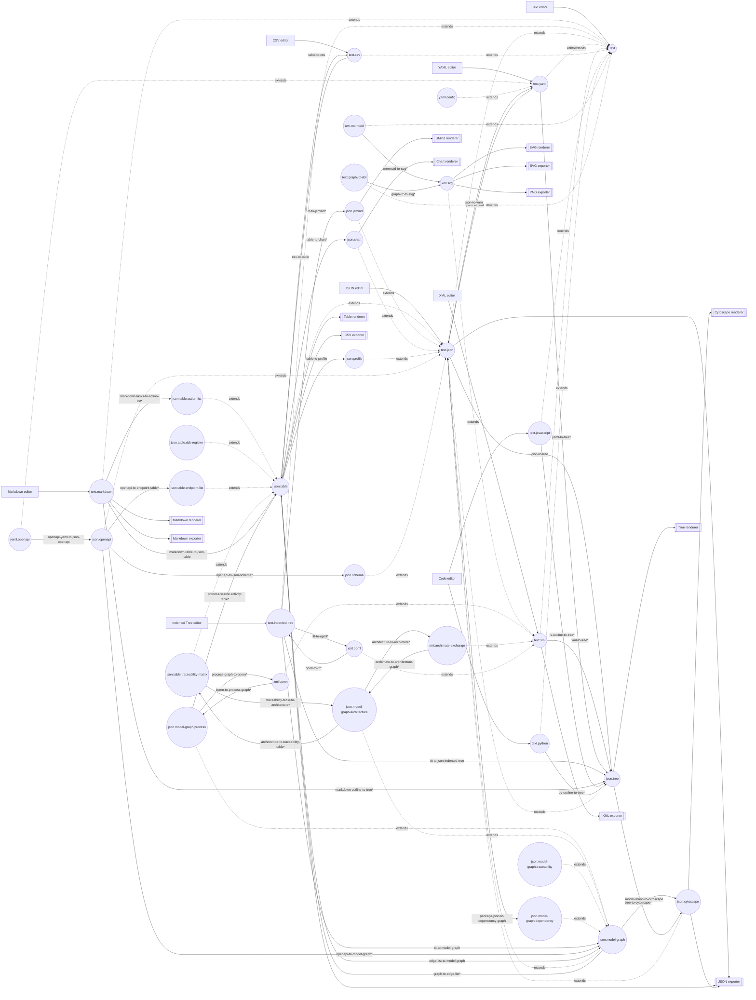

# LocalEdit Whitepaper — Proposed Languages, Plugin Contributions, Pipelines, and Prioritization

> Revision note: this expanded version explicitly builds on the plugin-streamlining foundation work: reusable intermediate dialects, shared tree/table/graph/SVG renderers, and named pipelines replacing direct source-specific viewers.


## 1. Purpose

This whitepaper proposes a useful set of LocalEdit language dialects, plugin contributions, transformers, renderers, exporters, and implementation priorities.

It builds on two foundation decisions:

1. **LocalEdit edits text as its only core document format.** All languages are specializations of `text`.
2. **Source-specific renderers should be streamlined into explicit transformers, reusable intermediate dialects, reusable renderers/exporters, and named pipelines.**

The purpose is to support a broad set of use cases across:

- coding;
- business analysis;
- business process modelling;
- brainstorming;
- data analysis;
- architecture development.

The proposal intentionally prioritizes contributions that enable many use cases at once. The most important early work is therefore not a single domain plugin, but a small set of reusable language/dialect foundations.

---

## 2. Core architecture assumption

The editor works on text.

Every document is fundamentally:

```js
{
  text: "...",
  languageId: "..."
}
```

A language id does not replace the text buffer. It adds interpretation.

Therefore, the language hierarchy should be rooted in `text`:

```text
text
  text.plain
  text.markdown
  text.mermaid
  text.graphviz-dot
  text.indented-tree
  text.csv
  text.json
  text.xml
  text.yaml
  text.javascript
  text.python
```

Specialized dialects and profiles sit under their serialization family:

```text
text.json
  json.tree
  json.table
  json.model-graph
  json.cytoscape
  json.jsmind
  json.chart
  json.schema
  json.openapi

text.xml
  xml.svg
  xml.bpmn
  xml.archimate-exchange
  xml.opml

text.yaml
  yaml.openapi
  yaml.frontmatter
  yaml.config
```

Parent contributions always apply to descendants. For example, a generic JSON formatter applies to `json.table.action-list`; an XML formatter applies to `xml.svg`; generic text search applies to every language.

If a generic operation may discard profile-specific meaning, the UI can warn the user. Contributors should not opt out of inheritance.

---

## 3. Language hierarchy

Recommended initial hierarchy:

```text
text
  text.plain
  text.markdown
    markdown.outline
    markdown.table
    markdown.tasks
  text.mermaid
  text.graphviz-dot
  text.indented-tree
  text.csv
  text.javascript
  text.python
  text.json
    json.tree
    json.table
      json.table.action-list
      json.table.risk-register
      json.table.endpoint-list
      json.table.traceability-matrix
      json.table.role-activity
    json.model-graph
      json.model-graph.process
      json.model-graph.architecture
      json.model-graph.traceability
      json.model-graph.dependency
    json.cytoscape
    json.jsmind
    json.chart
    json.profile
    json.schema
    json.openapi
    localedit.pipeline-json
  text.xml
    xml.svg
    xml.bpmn
    xml.archimate-exchange
    xml.opml
  text.yaml
    yaml.openapi
    yaml.frontmatter
    yaml.config
```

The hierarchy can be introduced without breaking existing files by retaining aliases such as:

```text
json -> text.json
xml -> text.xml
svg -> xml.svg
csv -> text.csv
markdown -> text.markdown
mermaid -> text.mermaid
graphviz -> text.graphviz-dot
cytoscape -> json.cytoscape
indented-tree -> text.indented-tree
jsmind-json -> json.jsmind
localedit-pipeline-json -> localedit.pipeline-json
```

Aliases can be preserved for user documents, old pipeline JSON, and plugin compatibility while the UI gradually moves to the more precise names.

---

## 4. Foundation-first design principle

The plugin ecosystem should not grow as:

```text
N source languages x M renderers/exporters
```

It should grow as:

```text
N source languages
  -> reusable intermediate dialects
  -> reusable renderers/exporters
```

A user-facing command may still appear as a direct preview or export, but internally it should often be a pipeline.

Example:

```text
View Indented Tree as graph
```

should be implemented as:

```text
text.indented-tree
  -> json.indented-tree
  -> json.model-graph
  -> json.cytoscape
  -> Cytoscape renderer
```

not as:

```text
text.indented-tree
  -> custom Indented Tree Cytoscape renderer
```

This makes future YAML, BPMN, ArchiMate, OpenAPI, process, architecture, and data-analysis contributions much easier to add.

---

## 5. Foundation plugin bundles

These foundation bundles should be implemented before or alongside new domain plugins.

### 5.1 Text core

Owns:

```text
language: text
language: text.plain
plain text editor support
basic text search/actions
plain text download/export
```

All other languages are descendants of `text`.

### 5.2 Language hierarchy / dialect registry

Owns:

```text
language registration
parent language validation
ancestor lookup
descendant lookup
alias resolution
inherited contribution matching
lossy/generic warning helpers
```

This may be a core module rather than a plugin.

### 5.3 JSON Tree bundle

Owns:

```text
language: json.tree
transformer: text.json -> json.tree
transformer: text.xml -> json.tree*
transformer: text.yaml -> json.tree*
transformer: json.indented-tree -> json.tree
renderer: json.tree -> tree preview
transformer: json.tree -> json.cytoscape*
exporter: json.tree -> JSON
```

Used by:

```text
JSON tree preview
XML tree preview
YAML tree preview
Indented Tree outline preview
Markdown outline preview
Pipeline flow/tree previews
```

### 5.4 JSON Table bundle

Owns:

```text
language: json.table
language: json.table.action-list
language: json.table.risk-register
language: json.table.endpoint-list
language: json.table.traceability-matrix
language: json.table.role-activity
transformer: text.csv -> json.table
transformer: json.table -> text.csv
transformer: markdown.table -> json.table
transformer: markdown.tasks -> json.table.action-list*
transformer: json.openapi -> json.table.endpoint-list*
transformer: json.table -> text.markdown*
renderer: json.table -> table preview
exporter: json.table -> CSV
exporter: json.table -> JSON
```

Used by:

```text
CSV preview
Markdown table preview
OpenAPI endpoint list
Action list
Risk register
Traceability matrix
Role/activity matrix
Data profiling
Charting
```

### 5.5 JSON Model Graph bundle

Owns:

```text
language: json.model-graph
language: json.model-graph.process
language: json.model-graph.architecture
language: json.model-graph.traceability
language: json.model-graph.dependency
linter: model graph structure
transformer: json.indented-tree -> json.model-graph
transformer: json.table -> json.model-graph*
transformer: json.model-graph -> json.cytoscape
transformer: json.model-graph -> text.mermaid*
transformer: json.model-graph -> text.graphviz-dot*
transformer: json.model-graph -> text.markdown*
transformer: json.model-graph -> json.table.traceability-matrix*
```

Used by:

```text
business analysis graphs
brainstorming graphs
process graphs
architecture graphs
traceability graphs
coding dependency graphs
OpenAPI dependency views
```

This is the most important semantic hub.

### 5.6 Cytoscape bundle

Owns:

```text
language: json.cytoscape
linter: Cytoscape graph shape
renderer: Cytoscape graph preview
formatter/compact transformers
exporter: json.cytoscape -> JSON
```

It should be the only plugin that directly owns Cytoscape graph rendering.

Other plugins should transform to `json.cytoscape` rather than mounting Cytoscape themselves.

### 5.7 SVG bundle

Owns:

```text
language: xml.svg
linter/sanitizer: XML/SVG safety
renderer: SVG preview
exporter: SVG
exporter: PNG
```

Used by:

```text
SVG files
Mermaid output
Graphviz output
chart output
future diagram outputs
```

### 5.8 YAML bundle

YAML should be included now, not deferred.

Owns:

```text
language: text.yaml
language: yaml.openapi
language: yaml.frontmatter
language: yaml.config
linter: YAML parse diagnostics
transformer: text.yaml -> text.json
transformer: text.json -> text.yaml
transformer: yaml.openapi -> json.openapi
transformer: yaml.frontmatter -> text.json
transformer: yaml.config -> json.tree*
transformer: yaml.config -> json.table*
transformer: yaml.config -> json.model-graph*
```

YAML is important because it enables configuration inspection, OpenAPI, front matter, architecture sidecars, and business-readable structured data.

### 5.9 Pipeline UX bundle

Owns:

```text
language: localedit.pipeline-json
linter: pipeline validation
renderer: pipeline flow preview
terminal step: register pipeline document
UI behavior: show renderer-ending pipelines as preview actions
UI behavior: show exporter-ending pipelines as export actions
UI behavior: show editor-ending pipelines as open/switch actions
```

This bundle makes pipelines feel like ordinary user actions.

---

## 6. Current plugin streamlining proposals

Before adding many new plugins, streamline the current packaged plugins as follows.

| Current contribution area | Proposed direction |
| --- | --- |
| Indented Tree outline preview | replace direct renderer with `text.indented-tree -> json.indented-tree -> json.tree -> tree renderer` |
| Indented Tree Cytoscape preview | replace direct renderer with `text.indented-tree -> json.indented-tree -> json.model-graph -> json.cytoscape -> Cytoscape renderer` |
| Indented Tree JSON export | replace direct exporter with `text.indented-tree -> json.indented-tree -> JSON exporter` |
| Indented Tree Cytoscape export | replace direct exporter with `text.indented-tree -> json.indented-tree -> json.model-graph -> json.cytoscape -> JSON exporter` |
| JSON tree preview | replace direct renderer with `text.json -> json.tree -> tree renderer` |
| JSON Cytoscape tree preview | replace direct renderer with `text.json -> json.tree -> json.cytoscape -> Cytoscape renderer` |
| XML tree preview | replace direct renderer with `text.xml -> json.tree* -> tree renderer` |
| CSV table preview | replace direct renderer with `text.csv -> json.table -> table renderer` |
| Mermaid SVG preview/export | refactor toward `text.mermaid -> xml.svg* -> SVG renderer/exporter` |
| Graphviz SVG preview/export | refactor toward `text.graphviz-dot -> xml.svg* -> SVG renderer/exporter` |
| SVG plugin | reframe as owner of `xml.svg` dialect and SVG/PNG export |
| Cytoscape plugin | reframe as owner of `json.cytoscape` and the only Cytoscape graph renderer |
| jsMind plugin | reframe as owner of `json.jsmind` renderer; use transformers for source formats |

`*` means lossy or potentially lossy.

Existing direct renderers can remain temporarily as advanced or internal contributions while equivalent pipelines are introduced.

---

## 7. Proposed use cases and pipelines

### 7.1 Coding

| Use case | Pipeline | Main contributions |
| --- | --- | --- |
| Inspect package dependencies | `package.json -> json.model-graph.dependency -> json.cytoscape -> graph renderer` | package parser, model graph, Cytoscape |
| Generate config documentation | `yaml.config / text.json / text.xml -> json.tree -> text.markdown*` | YAML/JSON/XML tree transforms, Markdown report |
| Inspect source outline | `text.javascript / text.python -> json.tree* -> tree renderer` | source outline extractor, tree renderer |
| API overview | `yaml.openapi -> json.openapi -> json.table.endpoint-list* -> table renderer` | YAML, OpenAPI, table |
| API dependency graph | `yaml.openapi -> json.openapi -> json.model-graph* -> json.cytoscape -> graph renderer` | OpenAPI, model graph, Cytoscape |
| API documentation | `json.openapi -> text.markdown* -> Markdown renderer/exporter` | OpenAPI report transformer |

Coding value should start with configuration, package metadata, and API files rather than full IDE-style source analysis.

### 7.2 Business analysis

| Use case | Pipeline | Main contributions |
| --- | --- | --- |
| Backlog/action list from Markdown | `markdown.tasks -> json.table.action-list* -> table renderer` | Markdown extraction, table renderer |
| Risk register | `text.csv / json.table.risk-register -> table renderer -> CSV/Markdown export` | table profile, CSV, Markdown |
| Stakeholder/capability mapping | `text.indented-tree -> json.model-graph* -> json.cytoscape -> graph renderer` | ITT, model graph, Cytoscape |
| Decision log report | `json.table -> text.markdown* -> Markdown renderer/exporter` | table-to-report |
| Traceability matrix | `json.model-graph.traceability -> json.table.traceability-matrix* -> table renderer` | model graph, table |

### 7.3 Business process modelling

| Use case | Pipeline | Main contributions |
| --- | --- | --- |
| Process outline to graph | `text.indented-tree -> json.model-graph.process* -> json.cytoscape -> graph renderer` | ITT, process graph |
| Process outline to Mermaid | `json.model-graph.process -> text.mermaid* -> Mermaid renderer` | process-to-Mermaid |
| BPMN import for inspection | `xml.bpmn -> json.model-graph.process* -> json.cytoscape -> graph renderer` | BPMN importer, graph renderer |
| BPMN role/activity table | `xml.bpmn -> json.model-graph.process* -> json.table.role-activity* -> table renderer` | BPMN, table |
| Lightweight BPMN export | `json.model-graph.process -> xml.bpmn* -> XML/BPMN exporter` | process graph, BPMN exporter |
| Process documentation | `json.model-graph.process -> text.markdown* -> Markdown renderer/exporter` | report transformer |

The first process modelling goal should not be a full BPMN editor. It should be import, inspect, transform, and document.

### 7.4 Brainstorming

| Use case | Pipeline | Main contributions |
| --- | --- | --- |
| Mind map from outline | `text.indented-tree -> json.jsmind* -> jsMind renderer` | ITT, jsMind |
| Graph from brainstorm | `text.indented-tree -> json.model-graph* -> json.cytoscape -> graph renderer` | ITT, model graph |
| OPML exchange | `xml.opml <-> text.indented-tree*` | OPML plugin |
| Brainstorm to action list | `text.indented-tree -> json.table.action-list* -> table renderer` | ITT-to-table |
| Markdown outline to mind map | `text.markdown -> json.tree* -> json.jsmind* -> jsMind renderer` | Markdown outline, jsMind |

### 7.5 Data analysis

| Use case | Pipeline | Main contributions |
| --- | --- | --- |
| CSV inspection | `text.csv -> json.table -> table renderer` | CSV, table |
| Data profiling | `json.table -> json.profile -> text.markdown` | profile transformer, report renderer |
| Quick chart | `json.table -> json.chart* -> chart renderer` | table, chart |
| Edge list graph | `json.table -> json.model-graph -> json.cytoscape -> graph renderer` | table-to-graph |
| Graph to edge list | `json.model-graph -> json.table* -> table renderer/exporter` | graph-to-table |

This keeps LocalEdit lightweight: useful for inspection and transformation, not a full notebook platform.

### 7.6 Architecture development

| Use case | Pipeline | Main contributions |
| --- | --- | --- |
| Capability map | `text.indented-tree -> json.model-graph.architecture* -> json.cytoscape -> graph renderer` | ITT, architecture profile |
| Application dependency map | `json.table / text.csv -> json.model-graph.architecture* -> graph renderer` | table-to-architecture graph |
| ArchiMate import | `xml.archimate-exchange -> json.model-graph.architecture* -> graph renderer` | ArchiMate importer |
| ArchiMate export | `json.model-graph.architecture -> xml.archimate-exchange*` | ArchiMate exporter |
| Traceability matrix | `json.model-graph.architecture -> json.table.traceability-matrix* -> table renderer` | graph-to-table |
| Architecture report | `json.model-graph.architecture -> text.markdown* -> Markdown renderer/exporter` | graph report |
| View-specific diagrams | `json.model-graph.architecture -> text.mermaid* / text.graphviz-dot* / json.cytoscape` | view generator |

Architecture should be implemented as a profile over `json.model-graph`, not as a separate incompatible graph format.

---

## 8. Transformer catalogue

`*` marks transformations expected to be lossy or potentially lossy.

### 8.1 Foundation transformations

```text
text.json -> json.tree
json.tree -> text.json
text.xml -> json.tree*
text.yaml -> json.tree*
text.csv -> json.table
json.table -> text.csv
text.indented-tree -> json.indented-tree
json.indented-tree -> json.tree
json.indented-tree -> json.model-graph
json.model-graph -> json.cytoscape
json.tree -> json.cytoscape*
text.mermaid -> xml.svg*
text.graphviz-dot -> xml.svg*
xml.svg -> image.png*
```

### 8.2 YAML and structured data

```text
text.yaml -> text.json
txt.json -> text.yaml
yaml.openapi -> json.openapi
yaml.frontmatter -> text.json
yaml.config -> json.tree*
yaml.config -> json.table*
yaml.config -> json.model-graph*
text.xml -> text.json*
text.json -> text.xml*
```

### 8.3 Markdown / outline / brainstorming

```text
text.markdown -> markdown.outline*
markdown.outline -> json.tree*
json.tree -> text.markdown*
text.markdown -> markdown.table*
markdown.table -> json.table
text.markdown -> markdown.tasks*
markdown.tasks -> json.table.action-list*
json.table.action-list -> markdown.tasks*
text.indented-tree -> json.jsmind*
json.jsmind -> text.indented-tree*
xml.opml -> text.indented-tree*
text.indented-tree -> xml.opml*
```

### 8.4 Graph and diagram transformations

```text
json.model-graph -> json.cytoscape
json.cytoscape -> json.model-graph*
json.model-graph -> text.mermaid*
text.mermaid -> json.model-graph*
json.model-graph -> text.graphviz-dot*
text.graphviz-dot -> json.model-graph*
json.model-graph -> json.table.traceability-matrix*
json.table.traceability-matrix -> json.model-graph*
json.model-graph -> text.markdown*
```

### 8.5 Business process

```text
text.indented-tree -> json.model-graph.process*
json.model-graph.process -> text.indented-tree*
xml.bpmn -> json.model-graph.process*
json.model-graph.process -> xml.bpmn*
json.model-graph.process -> json.table.role-activity*
json.table.role-activity -> json.model-graph.process*
json.model-graph.process -> text.mermaid*
json.model-graph.process -> text.graphviz-dot*
json.model-graph.process -> text.markdown*
```

### 8.6 Architecture

```text
text.indented-tree -> json.model-graph.architecture*
json.table -> json.model-graph.architecture*
text.csv -> json.table -> json.model-graph.architecture*
xml.archimate-exchange -> json.model-graph.architecture*
json.model-graph.architecture -> xml.archimate-exchange*
json.model-graph.architecture -> json.table.traceability-matrix*
json.table.traceability-matrix -> json.model-graph.architecture*
json.model-graph.architecture -> text.mermaid*
json.model-graph.architecture -> text.graphviz-dot*
json.model-graph.architecture -> text.markdown*
```

### 8.7 Coding / API

```text
package.json -> json.model-graph.dependency
text.javascript -> json.tree*
text.python -> json.tree*
text.javascript -> json.model-graph.dependency*
text.python -> json.model-graph.dependency*
yaml.openapi -> json.openapi
text.json -> json.openapi
json.openapi -> yaml.openapi
json.openapi -> json.table.endpoint-list*
json.openapi -> json.model-graph*
json.openapi -> json.schema*
json.schema -> json.model-graph*
json.model-graph -> json.schema*
json.openapi -> text.markdown*
```

### 8.8 Data analysis / charting

```text
json.table -> json.profile
json.profile -> text.markdown
json.table -> json.chart*
json.chart -> xml.svg*
json.chart -> chart-html*
json.table -> json.model-graph*
json.model-graph -> json.table*
```

---

## 9. Renderer and exporter strategy

### 9.1 Keep direct renderers where the source is the rendered artifact

Direct renderers are appropriate when the source language is naturally the renderer target:

```text
text.markdown -> Markdown HTML renderer
xml.svg -> SVG renderer
json.cytoscape -> Cytoscape renderer
json.jsmind -> jsMind renderer
json.table -> Table renderer
json.tree -> Tree renderer
json.chart -> Chart renderer
```

### 9.2 Use pipelines when another representation must be derived first

Pipelines should be used for:

```text
text.indented-tree -> graph preview
text.json -> Cytoscape tree preview
text.xml -> tree preview
text.csv -> table preview
text.mermaid -> SVG preview/export
text.graphviz-dot -> SVG preview/export
yaml.openapi -> endpoint table
xml.bpmn -> process graph
xml.archimate-exchange -> architecture graph
```

### 9.3 Optional graph renderer pack

Cytoscape should remain the default graph workbench renderer. Additional renderers can be optional plugins:

| Plugin | Best use |
| --- | --- |
| `vis-network-renderer` | simple interactive network graphs |
| `sigma-graphology-renderer` | larger graph exploration |
| `d3-network-renderer` | bespoke/custom graph visuals |
| `elk-layout-transformer` | layered architecture/process layout |
| `dagre-layout-transformer` | simple directed graph layout |

These should consume `json.model-graph` or `json.cytoscape` rather than introducing new source-specific graph renderers.

### 9.4 Chart renderer dependency choice

The chart plugin will probably need a new explicit dependency. It should not rely on D3 being transitively included by Mermaid.

Recommended investigation order:

| Option | Fit |
| --- | --- |
| Observable Plot | best initial fit; SVG-friendly, concise, good for exploratory charts |
| Apache ECharts | stronger dashboard-like renderer; heavier; good later |
| Chart.js | simple and popular, but canvas-first and less natural for SVG export |
| hand-written SVG charts | lowest dependency, but limited and maintenance-heavy |

Recommended first choice: **Observable Plot**, with D3 or required subpackages explicitly vendored as LocalEdit runtime dependencies if needed.

---

## 10. Contribution graph



---

## 11. Prioritization

### Phase 0 — Streamline the current plugin foundation

This phase should happen before substantial new domain work.

1. Add language hierarchy support rooted at `text`.
2. Add aliases for current language ids.
3. Introduce inherited contribution matching.
4. Add contribution visibility/deprecation metadata.
5. Introduce `json.tree`, `json.table`, `json.model-graph`, `json.cytoscape`, `json.jsmind`, and `xml.svg` as reusable target dialects.
6. Extract direct ITT/JSON/XML/CSV preview logic into transformers plus shared renderers.
7. Refactor Mermaid/Graphviz SVG preview/export toward `xml.svg`.
8. Reframe Cytoscape as the only `json.cytoscape` renderer.

Expected value:

```text
The current plugin set becomes a clean foundation for new language plugins instead of a set of isolated direct viewers.
```

### Phase 1 — Immediate cross-domain value

1. Complete `json.table` and the table renderer.
2. Complete `json.tree` and the tree renderer.
3. Complete `json.model-graph` minimal schema and linter.
4. Complete `json.model-graph -> json.cytoscape`.
5. Add YAML core support.
6. Add common pipeline actions for tree/table/graph/SVG previews.

Expected value:

```text
CSV, JSON, XML, YAML, Markdown, and Indented Tree can share a small set of tree/table/graph/SVG views.
```

### Phase 2 — Brainstorming, business analysis, and data analysis

1. Markdown task/table extraction.
2. Action list, risk register, and traceability table profiles.
3. ITT-to-table and ITT-to-model-graph transforms.
4. Data profiling from `json.table`.
5. Chart JSON and initial chart renderer.
6. OPML import/export.

Expected value:

```text
The editor becomes useful for workshop notes, action lists, risk registers, CSV inspection, quick profiling, and brainstorming flows.
```

### Phase 3 — Process modelling

1. Process profile over `json.model-graph`.
2. ITT-to-process-graph.
3. Process graph to Mermaid/DOT.
4. BPMN XML import to process graph.
5. Process graph to role/activity table.
6. Lightweight process graph to BPMN XML export.
7. Process graph to Markdown report.

Expected value:

```text
Business process models can be inspected, summarized, transformed, and documented without building a full BPMN editor.
```

### Phase 4 — Architecture development

1. Architecture profile over `json.model-graph`.
2. Architecture graph linting rules.
3. Architecture graph to Cytoscape/Mermaid/DOT views.
4. Architecture graph to traceability table.
5. CSV/table to architecture graph.
6. ArchiMate Exchange XML import.
7. Lightweight ArchiMate Exchange XML export.
8. Architecture graph to Markdown report.

Expected value:

```text
The workbench becomes useful for architecture exploration, capability maps, application dependencies, traceability, and architecture documentation.
```

### Phase 5 — Coding and API analysis

1. OpenAPI YAML/JSON normalization.
2. OpenAPI endpoint tables.
3. OpenAPI graph views.
4. JSON Schema graph views.
5. package.json dependency graph.
6. JavaScript/Python import graph extraction.
7. source outline extraction.

Expected value:

```text
The workbench gains developer utility without trying to become a full IDE.
```

### Phase 6 — Optional renderer expansion

1. Vis-network renderer.
2. Sigma/Graphology renderer.
3. D3 network renderer.
4. ELK layout transformer.
5. Dagre layout transformer.
6. ECharts dashboard renderer.

Expected value:

```text
Users can choose specialized visual renderers while the semantic language and transformer ecosystem stays stable.
```

---

## 12. Recommended first delivery slice

The best first delivery slice is:

```text
Foundation:
  text-rooted language hierarchy
  contribution inheritance
  language aliases
  contribution visibility/deprecation

Intermediate dialects:
  json.tree
  json.table
  json.model-graph
  json.cytoscape
  xml.svg

Shared renderers:
  tree renderer
  table renderer
  Cytoscape renderer
  SVG renderer/exporter

Migrated pipelines:
  view JSON as tree
  view XML as tree
  view CSV as table
  view ITT as tree
  view ITT as graph
  view Mermaid as SVG
  view Graphviz as SVG
```

This slice has a strong value-to-effort ratio because it improves current functionality and prepares the system for future plugins.

---

## 13. Summary recommendation

The main recommendation is:

```text
First streamline the current plugin set around explicit intermediate dialects and named pipelines.
Then build new plugins on top of those foundations.
```

The most important early investments are:

1. `text`-rooted language hierarchy;
2. inherited contribution matching;
3. `json.tree`;
4. `json.table`;
5. `json.model-graph`;
6. `json.cytoscape` as the common graph-renderer target;
7. `xml.svg` as the common SVG-renderer/exporter target;
8. YAML as a near-core structured text language;
9. pipeline actions that make composed transformations feel like ordinary previews and exports.

After that, the highest-value domain additions are:

1. Markdown/ITT structured extraction;
2. business tables and registers;
3. data profiling and charts;
4. process graph and BPMN import/export;
5. architecture graph and ArchiMate import/export;
6. OpenAPI and coding dependency analysis.

This order maximizes reuse. It avoids building one-off plugins and instead turns LocalEdit into a composable local workbench for structured text, models, diagrams, tables, and reports.
