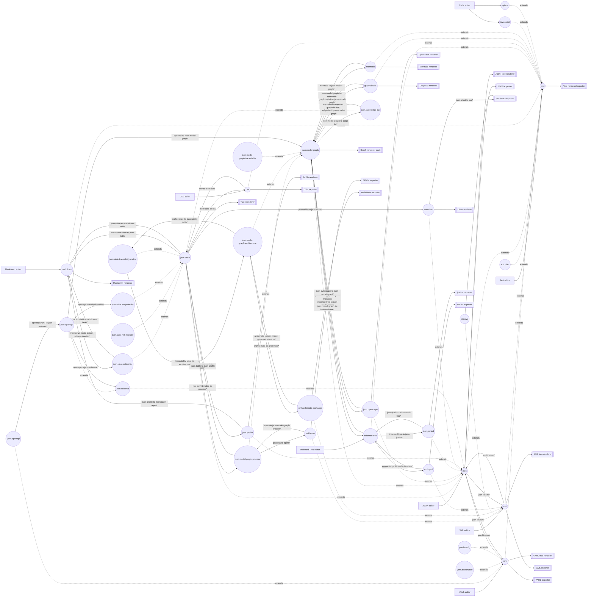

# LocalEdit Whitepaper 2 — Proposed Languages, Plugin Contributions, Pipelines, and Prioritization

## 1. Purpose

This whitepaper proposes a practical set of LocalEdit language families, dialects, profiles, plugin contributions, pipelines, renderers, exporters, and implementation priorities.

It assumes the structural model described in the companion whitepaper:

> LocalEdit edits text. Every supported format is a specialized language node under `text`. Contributions targeting parent languages automatically apply to descendants.

The goal is to deliver useful pipelines for:

- coding;
- business analysis;
- business process modelling;
- brainstorming;
- data analysis;
- architecture development.

---

## 2. Language hierarchy

The proposed hierarchy starts with `text` because every document is edited as text.

```mermaid
flowchart TD

  TEXT[text]

  TEXT --> TPLAIN[text.plain]
  TEXT --> MARKDOWN[markdown]
  TEXT --> CSV[csv]
  TEXT --> JSON[json]
  TEXT --> XML[xml]
  TEXT --> YAML[yaml]
  TEXT --> IT[indented-tree]
  TEXT --> MERMAID[mermaid]
  TEXT --> DOT[graphviz.dot]
  TEXT --> JS[javascript]
  TEXT --> PY[python]

  JSON --> JT[json.table]
  JT --> JTA[json.table.action-list]
  JT --> JTR[json.table.risk-register]
  JT --> JTE[json.table.endpoint-list]
  JT --> JTT[json.table.traceability-matrix]
  JT --> JTEDGE[json.table.edge-list]

  JSON --> JG[json.model-graph]
  JG --> JGP[json.model-graph.process]
  JG --> JGA[json.model-graph.architecture]
  JG --> JGT[json.model-graph.traceability]

  JSON --> JC[json.cytoscape]
  JSON --> JJ[json.jsmind]
  JSON --> JCH[json.chart]
  JSON --> JP[json.profile]
  JSON --> JSCH[json.schema]
  JSCH --> JO[json.openapi]

  XML --> XSVG[xml.svg]
  XML --> XBPMN[xml.bpmn]
  XML --> XARCH[xml.archimate-exchange]
  XML --> XOPML[xml.opml]

  YAML --> YO[yaml.openapi]
  YAML --> YF[yaml.frontmatter]
  YAML --> YC[yaml.config]
```



---

## 3. High-level design principle

Use a small number of strong intermediate languages:

| Intermediate language | Role |
|---|---|
| `json.table` | Canonical tabular/worklist/register format |
| `json.model-graph` | Canonical semantic graph format |
| `json.model-graph.process` | Process-specific graph profile |
| `json.model-graph.architecture` | Architecture-specific graph profile |
| `json.chart` | Declarative chart request format |
| `json.profile` | Data profiling/statistics result format |
| `yaml` | Human-readable structured source and OpenAPI/config bridge |

The key idea is not to build direct transformations between every pair of formats. Instead, most transformations should pass through reusable hubs.

Example:

```text
Markdown tasks
  -> json.table.action-list
  -> json.table
  -> csv
```

Example:

```text
XML-BPMN
  -> json.model-graph.process
  -> json.cytoscape
  -> Cytoscape renderer
```

---

## 4. Plugin bundles

### 4.1 Core text plugin

Languages:

```text
text
text.plain
```

Contributions:

```text
text-source-exporter
text-word-count-linter
text-basic-renderer
```

Applicability:

Because every language descends from `text`, these tools are available everywhere.

---

### 4.2 JSON family plugin

Languages:

```text
json
json.schema
json.openapi
```

Contributions:

```text
json-highlighter
json-parse-linter
json-tree-renderer
json-format-transformer
json-compact-transformer
json-to-yaml
json-to-xml*
json-source-exporter
json-schema-linter
json-schema-to-model-graph*
model-graph-to-json-schema*
```

Notes:

- `json` tools automatically apply to `json.table`, `json.cytoscape`, `json.model-graph`, and other JSON descendants.
- `*` means expected to be lossy.

---

### 4.3 YAML plugin

Languages:

```text
yaml
yaml.openapi
yaml.frontmatter
yaml.config
```

Recommended dependency:

```text
yaml
```

Contributions:

```text
yaml-highlighter
yaml-parse-linter
yaml-tree-renderer
yaml-to-json
json-to-yaml
yaml-to-json-table*
yaml-to-json-model-graph*
yaml-frontmatter-to-json
yaml-openapi-to-json-openapi
yaml-config-to-json-table*
yaml-config-to-json-model-graph*
yaml-source-exporter
```

Priority:

YAML should be included early because it enables OpenAPI, config inspection, architecture sidecars, front matter, and human-readable structured input.

---

### 4.4 XML family plugin

Languages:

```text
xml
xml.svg
xml.bpmn
xml.archimate-exchange
xml.opml
```

Contributions:

```text
xml-highlighter
xml-parse-linter
xml-tree-renderer
xml-format-transformer
xml-compact-transformer
xml-to-json*
json-to-xml*
xml-source-exporter
```

Specific dialect contributions:

```text
xml-svg-renderer
xml-svg-to-png-exporter
xml-bpmn-to-json-model-graph-process*
json-model-graph-process-to-xml-bpmn*
xml-archimate-to-json-model-graph-architecture*
json-model-graph-architecture-to-xml-archimate*
xml-opml-to-indented-tree*
indented-tree-to-xml-opml*
```

---

### 4.5 JSON Table plugin

Languages:

```text
json.table
json.table.action-list
json.table.risk-register
json.table.endpoint-list
json.table.traceability-matrix
json.table.edge-list
```

Contributions:

```text
json-table-schema-linter
json-table-renderer
json-table-editor-extension
json-table-profile-transformer
json-table-to-csv
csv-to-json-table
json-table-to-markdown-table
markdown-table-to-json-table
json-array-to-json-table
json-table-to-json-array
json-table-to-json-chart*
json-table-to-json-model-graph*
json-table-edge-list-to-json-model-graph
json-model-graph-to-json-table-edge-list*
```

Profile-specific contributions:

```text
markdown-tasks-to-json-table-action-list*
json-table-action-list-to-markdown-tasks*
json-table-risk-register-linter
json-table-risk-register-to-markdown-report*
json-table-endpoint-list-renderer
json-table-traceability-matrix-renderer
json-table-traceability-matrix-to-json-model-graph-traceability*
```

---

### 4.6 JSON Model Graph plugin

Languages:

```text
json.model-graph
json.model-graph.process
json.model-graph.architecture
json.model-graph.traceability
```

Contributions:

```text
json-model-graph-schema-linter
json-model-graph-connectivity-linter
json-model-graph-to-json-cytoscape
json-cytoscape-to-json-model-graph*
json-model-graph-to-mermaid-flowchart*
json-model-graph-to-mermaid-mindmap*
json-model-graph-to-graphviz-dot*
graphviz-dot-to-json-model-graph*
mermaid-flowchart-to-json-model-graph*
json-model-graph-to-markdown-report*
json-model-graph-to-json-table-edge-list*
json-table-edge-list-to-json-model-graph
```

Process profile contributions:

```text
indented-tree-to-json-model-graph-process*
json-model-graph-process-to-indented-tree*
xml-bpmn-to-json-model-graph-process*
json-model-graph-process-to-xml-bpmn*
json-model-graph-process-to-role-activity-table*
role-activity-table-to-json-model-graph-process*
json-model-graph-process-to-mermaid-flowchart*
json-model-graph-process-to-graphviz-dot*
json-model-graph-process-to-markdown-report*
```

Architecture profile contributions:

```text
indented-tree-to-json-model-graph-architecture*
json-table-to-json-model-graph-architecture*
xml-archimate-to-json-model-graph-architecture*
json-model-graph-architecture-to-xml-archimate*
json-model-graph-architecture-to-traceability-table*
traceability-table-to-json-model-graph-architecture*
json-model-graph-architecture-to-mermaid*
json-model-graph-architecture-to-graphviz-dot*
json-model-graph-architecture-to-markdown-report*
```

Traceability profile contributions:

```text
json-table-traceability-matrix-to-json-model-graph-traceability*
json-model-graph-traceability-to-json-table-traceability-matrix*
json-model-graph-traceability-to-markdown-report*
```

---

### 4.7 Cytoscape and graph renderer plugins

Languages:

```text
json.cytoscape
```

Contributions:

```text
json-cytoscape-schema-linter
json-cytoscape-renderer
json-cytoscape-format-transformer
json-cytoscape-compact-transformer
json-cytoscape-to-json-model-graph*
json-model-graph-to-json-cytoscape
```

Optional graph renderer pack:

```text
json-model-graph-to-vis-network*
vis-network-renderer
json-model-graph-to-sigma-graphology*
sigma-graphology-renderer
json-model-graph-to-d3-network*
d3-network-renderer
json-model-graph-to-elk-layout
json-model-graph-to-dagre-layout
```

Recommendation:

Keep Cytoscape as the default graph workbench renderer. Add alternatives as optional plugins.

---

### 4.8 Chart plugin

Languages:

```text
json.chart
json.profile
```

Recommended dependency investigation:

```text
Observable Plot first
Apache ECharts later
Chart.js only if canvas-first output is acceptable
```

Contributions:

```text
json-table-to-json-profile
json-profile-to-markdown-report
json-table-to-json-chart*
json-chart-to-observable-plot*
json-chart-to-echarts*
json-chart-to-svg*
json-chart-renderer
json-profile-renderer
json-profile-linter
```

Recommendation:

Do not rely on Mermaid's internal D3 dependency. If D3 or Observable Plot is needed, vendor it explicitly as a plugin-owned local runtime bundle.

---

### 4.9 Markdown and Indented Tree plugins

Languages:

```text
markdown
indented-tree
json.jsmind
xml.opml
```

Contributions:

```text
markdown-renderer
markdown-to-html-exporter
markdown-outline-to-indented-tree*
indented-tree-to-markdown-outline*
markdown-table-to-json-table
json-table-to-markdown-table
markdown-tasks-to-json-table-action-list*
json-table-action-list-to-markdown-tasks*
indented-tree-to-json-model-graph
json-model-graph-to-indented-tree*
indented-tree-to-json-jsmind*
json-jsmind-to-indented-tree*
indented-tree-to-xml-opml*
xml-opml-to-indented-tree*
```

---

### 4.10 Coding analysis plugin

Languages:

```text
javascript
python
json.package
```

Possible additions:

```text
json.package
```

Contributions:

```text
package-json-to-json-model-graph
json-model-graph-to-package-dependency-report*
javascript-imports-to-json-model-graph*
python-imports-to-json-model-graph*
source-outline-to-indented-tree*
source-outline-to-json-model-graph*
```

Priority:

Start with `package.json` dependency graph because it is simple, useful, and avoids full language AST complexity.

---

## 5. Use cases and recommended pipelines

### 5.1 Coding

```text
package.json
  -> json.model-graph
  -> json.cytoscape
  -> Cytoscape renderer
```

```text
yaml.openapi
  -> json.openapi
  -> json.table.endpoint-list*
  -> Table renderer
```

```text
json.schema
  -> json.model-graph*
  -> Graph renderer
```

### 5.2 Business analysis

```text
markdown tasks
  -> json.table.action-list*
  -> Table renderer
  -> CSV exporter
```

```text
json.table.risk-register
  -> markdown report*
  -> Markdown renderer
```

```text
indented-tree
  -> json.model-graph.traceability*
  -> json.table.traceability-matrix*
  -> Table renderer
```

### 5.3 Business process modelling

```text
indented-tree
  -> json.model-graph.process*
  -> mermaid flowchart*
  -> Mermaid renderer
```

```text
xml.bpmn
  -> json.model-graph.process*
  -> json.cytoscape
  -> Cytoscape renderer
```

```text
json.model-graph.process
  -> role-activity table*
  -> Table renderer
```

### 5.4 Brainstorming

```text
indented-tree
  -> json.jsmind*
  -> jsMind renderer
```

```text
indented-tree
  -> json.model-graph
  -> json.cytoscape
  -> Cytoscape renderer
```

```text
xml.opml
  -> indented-tree*
  -> json.jsmind*
  -> jsMind renderer
```

### 5.5 Data analysis

```text
csv
  -> json.table
  -> json.profile
  -> Profile renderer
```

```text
csv
  -> json.table
  -> json.chart*
  -> Chart renderer
```

```text
json.table.edge-list
  -> json.model-graph
  -> Graph renderer
```

### 5.6 Architecture development

```text
indented-tree
  -> json.model-graph.architecture*
  -> json.cytoscape
  -> Cytoscape renderer
```

```text
xml.archimate-exchange
  -> json.model-graph.architecture*
  -> architecture report*
  -> Markdown renderer
```

```text
json.model-graph.architecture
  -> json.table.traceability-matrix*
  -> Table renderer
```

---

## 6. Contribution graph



---

## 7. Prioritization

### Phase 1 — Foundation and immediate value

1. Language hierarchy support under `text`.
2. Mandatory inherited contribution matching.
3. YAML plugin.
4. JSON Table plugin.
5. JSON Model Graph plugin.
6. Markdown/Indented Tree bridges to `json.table` and `json.model-graph`.

Value delivered:

- action lists;
- simple business registers;
- CSV and Markdown table workflows;
- graph exploration from outlines;
- YAML/OpenAPI/config entry point.

### Phase 2 — Rendering and pipeline leverage

7. Cytoscape bridge for `json.model-graph`.
8. Mermaid and Graphviz exports from `json.model-graph`.
9. Data profile plugin.
10. Basic chart plugin using explicit local chart dependency.
11. OPML import/export.

Value delivered:

- visual graph workflows;
- diagram export;
- simple data analysis;
- mind map exchange.

### Phase 3 — Domain profiles

12. Process profile over `json.model-graph`.
13. BPMN XML import/export.
14. Architecture profile over `json.model-graph`.
15. ArchiMate Exchange XML import/export.
16. Traceability table/profile support.

Value delivered:

- process modelling;
- architecture modelling;
- traceability views;
- interchange with external modelling tools.

### Phase 4 — Coding and API analysis

17. OpenAPI/JSON Schema plugin.
18. Endpoint table and API graph pipelines.
19. `package.json` dependency graph.
20. JavaScript/Python import graph extraction.

Value delivered:

- API documentation;
- dependency exploration;
- source outline and import/dependency graphing.

### Phase 5 — Optional renderer expansion

21. Vis-network renderer.
22. Sigma/Graphology renderer.
23. ELK layout transformer.
24. Dagre layout transformer.
25. ECharts dashboard renderer.

Value delivered:

- larger graph handling;
- alternative layouts;
- richer dashboards.

---

## 8. Recommended first delivery slice

The first useful delivery slice should be:

```text
text-rooted language hierarchy
+ yaml
+ json.table
+ json.model-graph
+ markdown/indented-tree/table bridges
+ Cytoscape/Mermaid/DOT graph outputs
```

This enables many workflows before any heavy domain plugin is built.

Minimum useful pipelines:

```text
Markdown tasks -> JSON-Table-ActionList -> Table renderer -> CSV
CSV -> JSON-Table -> Profile renderer
Indented Tree -> JSON-ModelGraph -> Cytoscape renderer
Indented Tree -> JSON-ModelGraph -> Mermaid/DOT/SVG
YAML-OpenAPI -> JSON-OpenAPI -> Endpoint Table
```

---

## 9. Summary recommendation

LocalEdit should evolve into a text-rooted structured-data workbench.

The priority should not be to add many isolated plugins. The priority should be to add a small number of reusable intermediate languages and make plugins inherit across the language hierarchy.

The best sequence is:

```text
1. language hierarchy
2. YAML
3. JSON Table
4. JSON Model Graph
5. Markdown/Indented Tree bridges
6. graph and table renderers
7. chart/profile support
8. process, architecture, API, and coding profiles
```

This gives the largest number of useful pipelines with the smallest amount of core complexity.
