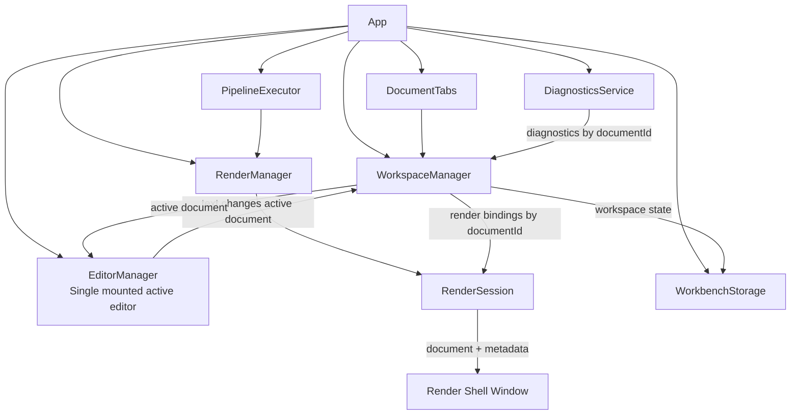

# Multi-Document Workspace Design for LocalEdit

## Status

**Proposal**  
Target repository: `NevynIt/LocalEdit`  
Target area: `editor-workbench/`  
Primary goal: extend LocalEdit from a single-document editor into a multi-document workspace while keeping editor tabs, preview windows, diagnostics, pipelines, autosave, and plugin behavior coherent.

---

## 1. Executive summary

LocalEdit currently behaves as a single-document workbench: the application owns one current `DocumentModel`, one mounted editor surface, and a flat list of open render sessions. This is simple and works well for the current local-first editor, but it becomes ambiguous once the user can open more than one document.

The recommended design is to introduce a **workspace layer** above the existing editor, renderer, pipeline, diagnostics, and storage services.

The workspace should contain multiple **document instances**. Each open tab is a separate document instance, even if two instances were opened from the same local file. The application should not attempt duplicate detection because browser-local file identity is not reliable enough and because opening the same file twice can be a valid workflow.

The editor should initially remain a **single mounted editor** showing the active document. This gives multi-document behavior with a controlled amount of refactoring. Side-by-side or multi-pane editing can be added later without changing the core document identity model.

The most important design rule is:

> Preview windows must be bound to the document instance that opened them, not to whichever document is currently active.

Every renderer window should visibly show which document instance it is rendering. This should be shell-level preview chrome, not something each renderer plugin has to implement separately.

---

## 2. Design goals

The multi-document extension should:

1. Allow multiple documents to be open at the same time.
2. Treat every opened file as a separate document instance.
3. Avoid duplicate-file detection.
4. Preserve the current plugin contribution model.
5. Keep the editor implementation simple by mounting only one active editor in the first version.
6. Bind render windows to source document instances.
7. Make renderer windows visibly identify their source document.
8. Keep diagnostics document-scoped.
9. Keep autosave and recovery document-scoped.
10. Preserve the local-first, no-backend, no-runtime-network architecture.
11. Prepare for later side-by-side editing without requiring it now.

---

## 3. Non-goals for the first implementation

The first multi-document implementation should not try to solve every workspace feature.

Out of scope for version 1:

- side-by-side editor panes;
- cross-document references;
- project folders;
- stable file-system identity;
- automatic detection that the same local file was opened twice;
- collaborative editing;
- background file watching;
- automatic save-back to the original source file;
- inter-document dependency tracking;
- renderer windows that survive source-document closure as editable linked artifacts.

These can be added later if needed.

---

## 4. Current architecture summary

The current application has a strong single-document center.

At application level, `App` owns:

```js
this.document = new DocumentModel({ text: "", languageId: "plain-text" });
this.autosaveTimer = 0;
this.autoRefreshTimer = 0;
this.renderSessions = [];
```

The editor change callback updates that one document:

```js
this.editor.onDidChange((text) => {
  this.document = this.document.cloneWith({ text: text });
  this.scheduleAutosave();
  this.scheduleAutoRefresh();
});
```

File opening replaces the current document:

```js
this.setDocument(nextDocument.cloneWith({ languageId: inferredLanguage }));
```

Renderer refresh currently refreshes the flat render-session list with the current document:

```js
this.renderSessions.forEach((session) => {
  session.refresh(this.document);
});
```

This is the core ambiguity to remove. In a multi-document workspace, a render session opened from document A must not accidentally refresh with document B just because B is active when the timer fires.

Several existing components are already useful for the proposed design:

- `EditorManager` can remain the manager of the single mounted active editor.
- `RenderSession` already accepts `params` and `metadata`, which can be used to carry source-document and pipeline metadata.
- `PipelineExecutor` already treats renderers as terminal pipeline steps.
- `WorkbenchStorage` already offers a general key-value persistence layer.
- `DiagnosticsService` already has a `target` field in normalized diagnostics, which can be extended to include document identity.

---

## 5. Core concept: document instances

A **document instance** is an open workspace object.

It is not the same thing as a file. The same local file may be opened twice, producing two different document instances.

This is intentional.

Reasons:

- browser file pickers do not provide a reliable full local path;
- file name, size, and modified date are weak identifiers;
- the user may deliberately open the same file twice to fork, compare, test transformations, or use different preview pipelines;
- false duplicate detection would be worse than allowing duplicates.

Therefore:

> Opening a file always creates a new document instance.

No attempt should be made to merge, detect, or reuse an existing instance.

---

## 6. Proposed workspace model

Introduce a `WorkspaceManager` or equivalent document store.

Conceptual state:

```js
{
  documents: Map<documentId, DocumentRecord>,
  order: ["doc-1", "doc-2", "doc-3"],
  activeDocumentId: "doc-2"
}
```

A `DocumentRecord` should contain application state around a `DocumentModel`:

```js
{
  id: "doc-uuid",
  document: DocumentModel,
  displayName: "notes.md",
  ordinalLabel: "notes.md (2)",
  dirty: false,
  version: 0,
  diagnostics: [],
  editorId: "codemirror",
  viewState: null,
  renderBindings: []
}
```

The underlying `DocumentModel` can stay mostly as it is, but should either gain an `id` or be wrapped by the `DocumentRecord` that owns the id.

Recommended distinction:

```js
DocumentRecord.id        // workspace identity, stable while tab is open
DocumentModel.fileName   // user-facing file name, not unique
DocumentRecord.displayName // tab label, may include disambiguator
```

Do not use `fileName` as a key.

---

## 7. Display names and duplicate labels

Since duplicate detection is intentionally not used, the user may have several document instances with the same file name.

The UI should disambiguate them without implying that they are the same underlying file.

Example tabs:

```text
notes.md     notes.md (2)     notes.md (3)     outline.json
```

The suffix is only a workspace display convention.

Internally:

```js
{
  id: "doc-9fd3",
  fileName: "notes.md",
  displayName: "notes.md (2)"
}
```

The suffix should be recomputed from currently open tabs. It should not be used as persistent identity.

For clarity, renderer windows can also show a short internal id:

```text
Rendering: notes.md (2) · doc-9fd3
```

This is especially helpful when several tabs share the same apparent file name.

---

## 8. Editor strategy

The recommended version-1 strategy is:

> One workspace, many document records, one mounted active editor.

This avoids a large jump in complexity.

The active editor always displays the active document. Switching tabs performs three operations:

1. Save the current editor text into the old active `DocumentRecord`.
2. Save editor view state if supported.
3. Load the next document text, language, diagnostics, and view state into the mounted editor.

Conceptual logic:

```js
async function switchDocument(nextDocumentId) {
  workspace.commitEditorText(editor.getText());
  workspace.saveViewState(editor.getViewState?.());

  workspace.setActiveDocument(nextDocumentId);

  const record = workspace.getActiveRecord();
  editor.setText(record.document.text, record.document.languageId);
  await editor.applyLanguage(record.document.languageId);
  editor.setDiagnostics(record.diagnostics || []);
  editor.restoreViewState?.(record.viewState);

  updateUiForActiveDocument();
}
```

This keeps the existing `EditorManager` useful and avoids creating one CodeMirror instance per tab.

Later, side-by-side editing can be implemented by allowing multiple editor surfaces, each attached to one `documentId`. The document identity and render-binding model would remain valid.

---

## 9. Application API changes

The current app-level API is centered on `this.document`.

It should move toward workspace-aware methods.

Recommended app methods:

```js
getActiveDocument()
getActiveDocumentId()
getActiveRecord()
openDocument(documentModel, options)
closeDocument(documentId)
switchDocument(documentId)
replaceDocument(documentId, documentModel)
updateDocumentText(documentId, text)
setDocumentLanguage(documentId, languageId)
```

The existing methods can remain temporarily as compatibility shims:

```js
getDocument() {
  return this.workspace.getActiveDocument();
}

setDocument(documentModel) {
  this.workspace.replaceActiveDocument(new DocumentModel(documentModel));
  this.reloadActiveDocumentIntoEditor();
}
```

This minimizes the initial refactor while making the internal direction clear.

---

## 10. File opening behavior

File opening should always create a new document instance.

Current behavior:

```js
this.setDocument(nextDocument.cloneWith({ languageId: inferredLanguage }));
```

Proposed behavior:

```js
const document = nextDocument.cloneWith({ languageId: inferredLanguage });
const record = workspace.openDocument(document, {
  source: "file-picker"
});

await app.switchDocument(record.id);
await app.persistWorkspace();
```

There should be no code path like:

```js
if (alreadyOpen(file)) switchToExistingTab();
```

That logic should be deliberately avoided.

---

## 11. New documents and pipeline-created documents

Plugin examples, pipeline outputs, and terminal steps should also create or update document instances explicitly.

Current terminal steps include concepts like:

- replace current text;
- open new document;
- copy to clipboard;
- open editor.

In the multi-document model:

### Replace current text

This should mutate the active document instance:

```js
app.replaceDocument(app.getActiveDocumentId(), input.sourceDocument.cloneWith({
  text: input.text,
  languageId: input.languageId
}));
```

### Open new document

This should create a new document instance and switch to it:

```js
const record = app.openDocument(new DocumentModel({
  text: input.text,
  languageId: input.languageId,
  fileName: input.fileName || "pipeline-output.txt",
  mimeType: "text/plain"
}), {
  source: "pipeline",
  pipelineId: input.pipeline.id
});

await app.switchDocument(record.id);
```

This gives pipeline outputs the same lifecycle as file-opened documents.

---

## 12. Renderer binding model

Renderer sessions must no longer be tracked as a flat application-level array.

Instead, each preview should have a binding.

```js
{
  id: "binding-uuid",
  documentId: "doc-uuid",
  session: RenderSession,
  mode: "direct-render", // or "pipeline-render"
  rendererId: "markdown-preview",
  pipelineId: null,
  pipelineSpec: null,
  params: {},
  sourceVersionAtOpen: 12,
  lastRenderedVersion: 12,
  documentTitleAtOpen: "notes.md (2)"
}
```

For a pipeline-rendered preview:

```js
{
  id: "binding-uuid",
  documentId: "doc-uuid",
  session: RenderSession,
  mode: "pipeline-render",
  rendererId: "cytoscape-preview",
  pipelineId: "markdown-to-graph-preview",
  pipelineSpec: { /* frozen or resolvable pipeline definition */ },
  params: {},
  sourceVersionAtOpen: 4,
  lastRenderedVersion: 4
}
```

Recommended storage in memory:

```js
renderBindingsByDocumentId: Map<documentId, RenderBinding[]>
```

The central rule is:

> A render binding points to a document instance id. Refresh uses that document id, never the active document by accident.

---

## 13. Opening a renderer

When the user opens a renderer from the active tab:

```js
async function openRenderer(rendererId) {
  const documentId = workspace.activeDocumentId;
  const record = workspace.getRecord(documentId);

  const result = await executeDirectRender(rendererId, record.document, {
    documentId,
    documentDisplayName: record.displayName,
    sourceVersion: record.version
  });

  workspace.addRenderBinding(documentId, {
    id: makeId("binding"),
    documentId,
    session: result.session,
    mode: "direct-render",
    rendererId,
    params: {},
    sourceVersionAtOpen: record.version,
    lastRenderedVersion: record.version
  });
}
```

Opening a renderer through a pipeline follows the same principle but stores enough pipeline information to rerun the pipeline for that document.

---

## 14. Refreshing renderers

The current refresh behavior should be replaced.

Current behavior:

```js
session.refresh(this.document);
```

This is unsafe because `this.document` is the active document, not necessarily the source document of the preview.

Proposed behavior:

```js
async function refreshRenderersForDocument(documentId) {
  const record = workspace.getRecord(documentId);
  const bindings = workspace.getRenderBindings(documentId);

  for (const binding of bindings) {
    if (!binding.session.isOpen()) {
      workspace.removeRenderBinding(binding.id);
      continue;
    }

    if (binding.mode === "direct-render") {
      binding.session.updateMetadata(makeRenderMetadata(record, binding));
      binding.session.refresh(record.document);
      binding.lastRenderedVersion = record.version;
      continue;
    }

    if (binding.mode === "pipeline-render") {
      await rerunPipelineRenderBinding(record, binding);
      binding.lastRenderedVersion = record.version;
    }
  }
}
```

Manual refresh from the toolbar can offer two levels:

1. **Refresh active document previews** — refresh previews bound to the current tab.
2. **Refresh all previews** — refresh all open previews across all documents.

For version 1, the toolbar button can simply refresh active-document previews.

---

## 15. Auto-refresh

Auto-refresh must be document-scoped.

A single global timer is no longer sufficient because the active document may change before the timer fires.

Recommended structure:

```js
autoRefreshTimersByDocumentId: Map<documentId, timerId>
```

On editor change:

```js
function onEditorChanged(text) {
  const documentId = workspace.activeDocumentId;
  workspace.updateText(documentId, text);
  scheduleAutosave(documentId);
  scheduleAutoRefresh(documentId);
}
```

Auto-refresh scheduling:

```js
function scheduleAutoRefresh(documentId) {
  clearTimeout(autoRefreshTimersByDocumentId.get(documentId));

  if (!autoRefreshEnabled) {
    return;
  }

  const timerId = setTimeout(() => {
    refreshRenderersForDocument(documentId);
  }, renderRefreshDelayMs);

  autoRefreshTimersByDocumentId.set(documentId, timerId);
}
```

This prevents document A from being rendered using document B after a tab switch.

---

## 16. Renderer window source identification

Every renderer window should visibly identify the document instance it is displaying.

This should be implemented in `render-shell.html` / `render-shell.js`, not in individual renderer plugins.

Reason:

- every renderer gets consistent source labeling;
- plugin authors do not need to remember to implement it;
- shell-level metadata can include document, renderer, pipeline, and version information;
- the user can always verify what they are seeing.

Recommended preview chrome:

```text
Rendering: notes.md (2) · doc-9fd3
Renderer: markdown-preview
Version: 17
```

For pipeline renderers:

```text
Rendering: notes.md (2) · doc-9fd3
Pipeline: markdown-to-outline-preview
Renderer: cytoscape-preview
Version: 17
```

If the document is dirty:

```text
Rendering: notes.md (2) · doc-9fd3 · unsaved changes
```

If the preview is stale:

```text
Rendering: notes.md (2) · doc-9fd3
Last rendered version: 15 · Current version: 17 · stale
```

Staleness can be shown only if the render shell receives both `lastRenderedVersion` and `currentVersion`, or if the main app updates the metadata before each render.

---

## 17. Render metadata

Extend the metadata sent to `RenderSession`.

Recommended metadata shape:

```js
{
  documentId: "doc-9fd3",
  documentDisplayName: "notes.md (2)",
  documentFileName: "notes.md",
  documentVersion: 17,
  dirty: true,
  rendererId: "markdown-preview",
  pipelineId: null,
  pipelineName: null,
  bindingId: "binding-a8c2",
  generatedAt: "2026-05-15T10:30:00.000Z"
}
```

For pipeline-generated render output:

```js
{
  documentId: "doc-9fd3",
  documentDisplayName: "notes.md (2)",
  documentVersion: 17,
  rendererId: "cytoscape-preview",
  pipelineId: "markdown-to-graph-preview",
  pipelineName: "Markdown to Graph Preview",
  bindingId: "binding-a8c2",
  generatedAt: "2026-05-15T10:30:00.000Z"
}
```

`RenderSession` already accepts metadata conceptually, so the main change is to make the app populate it and make the render shell display it.

Recommended `RenderSession` helper:

```js
updateMetadata(metadata) {
  this.metadata = Object.assign({}, this.metadata || {}, metadata || {});
}
```

Recommended send behavior:

```js
send(documentModel) {
  const message = {
    type: "render",
    rendererId: this.rendererId,
    document: documentModel,
    pluginPaths: this.pluginPaths,
    pluginLoadSpecs: this.pluginLoadSpecs,
    params: this.params,
    metadata: this.metadata
  };

  // existing postMessage behavior
}
```

---

## 18. Render shell layout

The render shell should have a small metadata bar above the output.

Example structure:

```html
<body>
  <header id="render-metadata" class="render-metadata"></header>
  <main id="render-output"></main>
</body>
```

Example rendering logic:

```js
function displayMetadata(metadata) {
  const header = document.getElementById("render-metadata");
  if (!header) {
    return;
  }

  const documentLabel = metadata.documentDisplayName || "Untitled document";
  const shortId = metadata.documentId ? metadata.documentId.slice(0, 8) : "";
  const version = Number.isFinite(metadata.documentVersion)
    ? "v" + metadata.documentVersion
    : "";

  const parts = [
    "Rendering: " + documentLabel + (shortId ? " · " + shortId : ""),
    metadata.pipelineId ? "Pipeline: " + metadata.pipelineId : null,
    metadata.rendererId ? "Renderer: " + metadata.rendererId : null,
    version
  ].filter(Boolean);

  header.textContent = parts.join("  |  ");
}
```

The render-shell message handler should call this before rendering output:

```js
global.addEventListener("message", async function (event) {
  const message = event.data;
  if (!message || message.type !== "render") {
    return;
  }

  displayMetadata(message.metadata || {});

  // existing render logic
});
```

The metadata bar should be visually quiet but always present.

---

## 19. Document lifecycle

### Opening

- Create a new `DocumentRecord`.
- Add it to `workspace.order`.
- Make it active.
- Load it into the editor.
- Persist workspace state.

### Editing

- Update the active `DocumentRecord`.
- Increment its version.
- Mark it dirty.
- Schedule document-scoped autosave.
- Schedule document-scoped preview refresh.

### Switching

- Commit old editor text.
- Save old view state.
- Set `activeDocumentId`.
- Load new text/language into editor.
- Restore diagnostics and view state.
- Update toolbar and panels.

### Closing

Version-1 recommended behavior:

- If dirty, ask the user whether to close without saving/download.
- Close render windows bound to the document.
- Remove render bindings.
- Remove document diagnostics.
- Remove document autosave state.
- Activate the next or previous tab.

Alternative behavior:

- Keep renderer windows open and mark them as source-closed.

For version 1, auto-closing bound renderers is simpler and less ambiguous.

---

## 20. Diagnostics

Diagnostics must become document-scoped.

The current diagnostics service stores diagnostics by source. In a multi-document workspace, the same linter source may run against multiple documents, so the key must include the document id.

Recommended normalized diagnostic target:

```js
{
  source: "json-parser",
  severity: "warning",
  message: "Unexpected token.",
  languageId: "json",
  range: {
    start: { line: 3, column: 12, offset: 41 },
    end: { line: 3, column: 13, offset: 42 }
  },
  target: {
    documentId: "doc-9fd3"
  },
  step: undefined
}
```

Recommended internal key:

```js
const key = documentId + "::" + source;
```

The diagnostics panel can initially show only diagnostics for the active document.

Later it may offer:

- active document diagnostics;
- all workspace diagnostics;
- filter by document;
- filter by severity.

Selecting a diagnostic should switch documents if needed:

```js
async function goToDiagnostic(diagnostic) {
  const documentId = diagnostic.target && diagnostic.target.documentId;

  if (documentId && documentId !== workspace.activeDocumentId) {
    await switchDocument(documentId);
  }

  editor.selectRange(diagnostic.range.start.offset, diagnostic.range.end.offset);
}
```

---

## 21. Pipelines

Pipelines need careful handling because they may transform the source before rendering.

A preview opened by a pipeline is not the same as directly rendering the source document. It is the terminal output of a pipeline executed against a source document.

Therefore, a pipeline-render binding must remember:

- the source document id;
- the pipeline id or pipeline spec;
- terminal renderer id;
- parameters;
- last rendered source version.

On refresh, the app should rerun the pipeline against the bound source document.

It should not merely call:

```js
session.refresh(sourceDocument);
```

because the session may expect transformed text, not the original source.

Recommended behavior:

```js
async function rerunPipelineRenderBinding(record, binding) {
  const result = await pipelineExecutor.execute(binding.pipelineSpec || binding.pipelineId, record.document);

  if (result && result.session && result.session !== binding.session) {
    // Prefer reusing the original session in the long term.
    // If the current executor opens a new window, refactor terminal renderer execution
    // so it can send to an existing session.
  }
}
```

A clean implementation may require separating two concepts that are currently close together:

1. executing a pipeline to produce terminal render output;
2. opening a new render window.

For multi-document refresh, it is useful to support:

```js
pipelineExecutor.renderIntoExistingSession(pipeline, sourceDocument, session, metadata)
```

or equivalent.

This prevents a pipeline preview refresh from opening a new window every time.

---

## 22. Storage and autosave

The current autosave keys are single-document oriented:

```text
autosaveDocument
selectedLanguage
```

Replace them with workspace-aware keys.

Recommended keys:

```text
workspaceState
document:<documentId>
```

Example `workspaceState`:

```js
{
  version: 1,
  activeDocumentId: "doc-9fd3",
  order: ["doc-9fd3", "doc-a21e"],
  documents: [
    {
      id: "doc-9fd3",
      displayName: "notes.md",
      fileName: "notes.md",
      languageId: "markdown",
      mimeType: "text/markdown",
      dirty: true,
      version: 17,
      editorId: "codemirror"
    },
    {
      id: "doc-a21e",
      displayName: "notes.md (2)",
      fileName: "notes.md",
      languageId: "markdown",
      mimeType: "text/markdown",
      dirty: true,
      version: 3,
      editorId: "codemirror"
    }
  ]
}
```

Example `document:<documentId>`:

```js
{
  id: "doc-9fd3",
  text: "# Notes\n...",
  languageId: "markdown",
  fileName: "notes.md",
  mimeType: "text/markdown",
  lastModified: 1780000000000
}
```

This keeps large text content out of the workspace index and makes updates smaller.

---

## 23. Recovery and migration

The first version should migrate old single-document autosave state.

Startup logic:

```js
const workspaceState = await storage.get("workspaceState");

if (workspaceState) {
  await restoreWorkspace(workspaceState);
  return;
}

const savedDocument = await storage.get("autosaveDocument");
const selectedLanguage = await storage.get("selectedLanguage");

if (savedDocument) {
  const document = new DocumentModel(savedDocument).cloneWith({
    languageId: selectedLanguage || savedDocument.languageId || "plain-text"
  });
  workspace.openDocument(document, { source: "legacy-autosave" });
} else {
  workspace.openDocument(new DocumentModel({
    text: "",
    languageId: "plain-text",
    fileName: "untitled.txt"
  }), { source: "startup" });
}
```

After successful migration, the app may leave the old keys in place for one release or remove them after the new workspace state is saved.

---

## 24. Toolbar and UI

Add a document tab strip between the toolbar and the editor area.

Conceptual layout:

```html
<header id="toolbar"></header>
<nav id="document-tabs"></nav>
<main id="workspace">
  <section id="editor-container"></section>
  <aside id="plugin-panel"></aside>
  <aside id="diagnostics-panel"></aside>
</main>
<footer id="status-bar"></footer>
```

Each tab should display:

```text
notes.md
notes.md (2)
* outline.json
```

Where `*` or a dot indicates dirty state.

Minimum tab actions:

- click to switch;
- close button;
- dirty indicator;
- tooltip with document id, file name, language, version.

Toolbar state should be derived from the active document:

```js
{
  activeDocumentId,
  activeDocumentDisplayName,
  languageId,
  editorId,
  editors,
  transformers,
  renderers,
  exporters,
  pipelines,
  autoRefreshEnabled,
  hasRenderSessionsForActiveDocument
}
```

The existing toolbar can keep most of its behavior, but its `hasRenderSessions` flag should become active-document-aware.

---

## 25. Export and save behavior

LocalEdit currently saves by downloading a file. That should remain true.

For multi-document, save/download should apply to the active document unless a specific document id is passed.

Recommended methods:

```js
saveSourceAsDownload(documentId = workspace.activeDocumentId)
exportDocument(exporterId, documentId = workspace.activeDocumentId)
```

After a successful source download, the app may mark the document as not dirty, but this is a design choice. Since browser download does not guarantee that the user overwrote the original source file, a conservative approach is to show a status such as:

```text
Downloaded notes.md. Marked current workspace copy as saved.
```

or keep dirty state until explicitly reset.

For version 1, marking clean after download is acceptable if the UI makes clear that LocalEdit is download-based, not directly writing to the original file.

---

## 26. Plugin compatibility

Most plugins should not need to know about multi-document workspaces.

Plugins should continue to receive a `DocumentModel` and context services.

The app and services should own document routing.

Recommended compatibility rule:

> Plugin APIs remain document-in/document-out. Workspace identity is managed by the host application.

Where useful, context can expose the active document id:

```js
context.workspace = {
  activeDocumentId,
  getDocumentLabel(documentId),
  publishDiagnostics(documentId, source, diagnostics)
}
```

But plugin authors should not be required to use this for normal linters, transformers, renderers, or exporters.

---

## 27. Security considerations

The proposed multi-document design does not change the core security model.

LocalEdit remains:

- local-first;
- no backend;
- no runtime dependency on remote resources;
- plugin-based;
- constrained by the existing local/extension hosting approach.

However, multi-document support increases the amount of sensitive content in memory at the same time. Since plugins are trusted local code and already process editor content, this does not introduce a new class of plugin access. It does mean that app-level services should avoid accidentally exposing all workspace documents to plugins unless there is a deliberate API for it.

Recommended rule:

> Default plugin calls should receive only the document being processed, not the entire workspace.

If a future plugin type needs workspace access, it should be explicit.

---

## 28. Error cases and user-visible behavior

### Renderer source document closed

Version-1 recommendation: close all render windows bound to a document when that document is closed.

Alternative later behavior: leave the render window open and show:

```text
Source document closed: notes.md (2) · doc-9fd3
```

### Renderer window manually closed

When refreshing or pruning bindings:

```js
if (!binding.session.isOpen()) {
  workspace.removeRenderBinding(binding.id);
}
```

### Active document changed before auto-refresh fires

This is handled by document-scoped timers. The timer captures `documentId`, not the active document object.

### Same file opened twice

Expected behavior:

- create two independent tabs;
- show disambiguated labels;
- renderer windows identify which instance they render;
- saving/downloading one does not affect the other.

### Pipeline output opens a new document

Expected behavior:

- create a new document instance;
- switch to it;
- title it from pipeline metadata or default to `pipeline-output.txt`;
- do not overwrite the source document unless the terminal step explicitly says replace current text.

---

## 29. Minimal class/module additions

Recommended new files:

```text
editor-workbench/core/workspace-manager.js
editor-workbench/core/document-tabs.js
editor-workbench/core/render-binding.js        // optional; may be plain objects
```

Recommended modified files:

```text
editor-workbench/core/app.js
editor-workbench/core/render-manager.js
editor-workbench/core/render-session.js
editor-workbench/core/pipeline-executor.js
editor-workbench/core/diagnostics-service.js
editor-workbench/core/toolbar.js
editor-workbench/core/storage.js
editor-workbench/render-shell.html
editor-workbench/render-shell.js
editor-workbench/editor.html
editor-workbench/index.html
```

---

## 30. WorkspaceManager sketch

```js
class WorkspaceManager {
  constructor() {
    this.records = new Map();
    this.order = [];
    this.activeDocumentId = null;
  }

  openDocument(documentModel, options) {
    const id = makeId("doc");
    const record = {
      id,
      document: new DocumentModel(documentModel),
      displayName: documentModel.fileName || "untitled.txt",
      dirty: false,
      version: 0,
      diagnostics: [],
      editorId: "codemirror",
      viewState: null,
      renderBindings: [],
      source: options && options.source || "unknown"
    };

    this.records.set(id, record);
    this.order.push(id);
    this.activeDocumentId = id;
    this.recomputeDisplayNames();
    return record;
  }

  getActiveRecord() {
    return this.records.get(this.activeDocumentId) || null;
  }

  getRecord(documentId) {
    return this.records.get(documentId) || null;
  }

  updateText(documentId, text) {
    const record = this.getRecord(documentId);
    if (!record) {
      return;
    }

    record.document = record.document.cloneWith({ text: text || "" });
    record.dirty = true;
    record.version += 1;
  }

  replaceDocument(documentId, documentModel) {
    const record = this.getRecord(documentId);
    if (!record) {
      return;
    }

    record.document = new DocumentModel(documentModel);
    record.dirty = true;
    record.version += 1;
    record.displayName = record.document.fileName || record.displayName || "untitled.txt";
    this.recomputeDisplayNames();
  }

  closeDocument(documentId) {
    const index = this.order.indexOf(documentId);
    if (index < 0) {
      return null;
    }

    const record = this.records.get(documentId);
    this.records.delete(documentId);
    this.order.splice(index, 1);

    if (this.activeDocumentId === documentId) {
      this.activeDocumentId = this.order[index] || this.order[index - 1] || null;
    }

    this.recomputeDisplayNames();
    return record;
  }

  addRenderBinding(documentId, binding) {
    const record = this.getRecord(documentId);
    if (!record) {
      return;
    }
    record.renderBindings.push(binding);
  }

  getRenderBindings(documentId) {
    const record = this.getRecord(documentId);
    return record ? record.renderBindings : [];
  }

  recomputeDisplayNames() {
    const counts = new Map();

    this.order.forEach((id) => {
      const record = this.records.get(id);
      const base = record.document.fileName || "untitled.txt";
      const count = (counts.get(base) || 0) + 1;
      counts.set(base, count);
      record.displayName = count === 1 ? base : base + " (" + count + ")";
    });
  }
}
```

This sketch is intentionally minimal. It can later be expanded with serialization, view state, close guards, and workspace diagnostics.

---

## 31. Render metadata sketch

```js
function makeRenderMetadata(record, binding) {
  return {
    documentId: record.id,
    documentDisplayName: record.displayName,
    documentFileName: record.document.fileName || "untitled.txt",
    documentLanguageId: record.document.languageId || "plain-text",
    documentVersion: record.version,
    dirty: record.dirty,
    rendererId: binding.rendererId,
    pipelineId: binding.pipelineId || null,
    pipelineName: binding.pipelineName || null,
    bindingId: binding.id,
    generatedAt: new Date().toISOString()
  };
}
```

---

## 32. Implementation phases

### Phase 1: Workspace foundation

- Add `WorkspaceManager`.
- Wrap current single document in a workspace with one document.
- Keep compatibility methods on `App`.
- Add document ids and versions.
- Update editor change handling to write to active document.

### Phase 2: Tabs

- Add `DocumentTabs` UI.
- Add open/switch/close behavior.
- Make file open create a new document instance every time.
- Make plugin examples create new document instances or explicitly replace current, depending on desired behavior.

### Phase 3: Document-scoped autosave

- Add `workspaceState` and `document:<id>` persistence.
- Migrate old `autosaveDocument`.
- Restore all open autosaved documents at startup.

### Phase 4: Render bindings

- Replace flat `renderSessions` with document-owned render bindings.
- Add document-scoped manual refresh.
- Add document-scoped auto-refresh timers.
- Prune closed renderer windows per binding.

### Phase 5: Renderer metadata chrome

- Add shell-level metadata header to `render-shell.html`.
- Populate `RenderSession.metadata` with document display name, id, version, renderer, pipeline, and dirty state.
- Update metadata on every refresh.

### Phase 6: Diagnostics

- Store diagnostics per document id and source.
- Show active document diagnostics initially.
- Allow diagnostic selection to switch tabs when needed.

### Phase 7: Pipeline refresh correctness

- Ensure pipeline-render previews refresh by rerunning the pipeline for the bound source document.
- Avoid opening a new renderer window on every pipeline refresh.
- Add helper support for rendering pipeline output into an existing session.

---

## 33. Recommended acceptance tests

### Test 1: Open two files

1. Open `a.md`.
2. Open `b.md`.
3. Switch between tabs.
4. Confirm text and language are preserved independently.

Expected result: no content leakage between tabs.

### Test 2: Open the same file twice

1. Open `notes.md`.
2. Open `notes.md` again.
3. Edit the second tab.

Expected result: two separate tabs exist; only the second changes.

### Test 3: Renderer bound to first duplicate

1. Open `notes.md` twice.
2. Open a preview from the first tab.
3. Switch to the second tab and edit it.
4. Refresh the first preview.

Expected result: the preview still shows the first tab's document, not the second.

### Test 4: Renderer source label

1. Open a preview from `notes.md (2)`.

Expected result: the render window visibly says something like:

```text
Rendering: notes.md (2) · doc-xxxx
```

### Test 5: Auto-refresh after tab switch

1. Enable auto-refresh.
2. Open preview for document A.
3. Edit document A.
4. Immediately switch to document B before the timer fires.

Expected result: document A's preview refreshes with document A, not document B.

### Test 6: Diagnostics isolation

1. Open two JSON documents.
2. Make only the second invalid.
3. Run diagnostics.
4. Switch between tabs.

Expected result: diagnostics appear only for the document they belong to.

### Test 7: Pipeline-render preview refresh

1. Open a pipeline-render preview.
2. Edit the source document.
3. Refresh the preview.

Expected result: the pipeline reruns from the source document and updates the same preview window.

### Test 8: Close document with preview

1. Open a document.
2. Open preview.
3. Close the document.

Expected result for version 1: the bound preview closes or is removed cleanly from binding state.

---

## 34. Main design decisions

### Decision 1: Use document instances, not file identity

Every open tab gets a unique `documentId`. The app does not try to determine whether two tabs came from the same file.

### Decision 2: Keep one mounted editor initially

This minimizes refactoring and keeps the current `EditorManager` useful.

### Decision 3: Bind previews to document ids

A preview belongs to the document instance that opened it.

### Decision 4: Renderer windows must identify their source

The render shell should display source-document metadata consistently for all renderer plugins.

### Decision 5: Make diagnostics document-scoped

Diagnostics from the same source must not overwrite diagnostics for another document.

### Decision 6: Make autosave workspace-aware

The app should persist the set of open documents, the active tab, and each document's text.

### Decision 7: Treat pipeline previews as bound computations

Pipeline previews should refresh by rerunning the pipeline against the bound source document, not by sending the raw current document to the preview shell.

---

## 35. Suggested final architecture



---

## 36. Summary

The safest and most incremental way to make LocalEdit multi-document is to add a workspace layer while keeping one active mounted editor.

The workspace owns document instances. Every open tab is independent. The same local file may be opened twice and edited differently. No duplicate detection should be attempted.

Renderers must be bound to document instance ids. A renderer window should never implicitly follow the active editor. It should render the document instance that opened it, and it should visibly show that document's display name, short id, version, renderer, and pipeline where applicable.

Diagnostics, autosave, and refresh timers should also become document-scoped.

This design keeps the current local-first plugin architecture intact while removing the main ambiguity that would otherwise appear as soon as more than one document is open.
